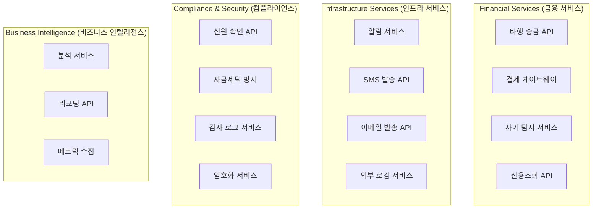
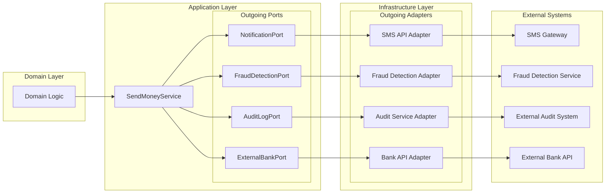

# 외부 API 통합 문서

## 외부 API 통합 현황

BuckPal 프로젝트는 **외부 API와의 통합이 없는** 완전히 **자급자족적인 애플리케이션**입니다.

### 현재 상태 분석

```
❌ 외부 API 통합이 없는 항목들:
├── HTTP Client 없음          # RestTemplate, WebClient, Feign 미사용
├── 외부 서비스 호출 없음       # 결제, 인증, 알림 서비스 없음
├── API Key 관리 없음         # 환경변수나 설정파일에 API 키 없음
├── Rate Limiting 없음        # 외부 API 호출 제한 설정 없음
├── Circuit Breaker 없음      # 장애 격리 패턴 없음
└── 외부 의존성 없음          # 순수 내부 비즈니스 로직만

✅ 현재 통합된 시스템들:
├── H2 Database              # 내장 데이터베이스 (외부 아님)
├── Spring Boot Actuator     # 내장 모니터링 (외부 아님)  
├── MapStruct               # 컴파일타임 매핑 (외부 아님)
└── JUnit/AssertJ           # 테스트 프레임워크 (개발시만)
```

## 외부 통합이 필요한 잠재적 시나리오

실제 은행 시스템이라면 필요할 수 있는 외부 API들을 분석해봅니다.

### 외부 통합 가능성 매트릭스



### 헥사고날 아키텍처에서 외부 API 통합



## 예상 외부 API 통합 구현

### 1. SMS 알림 서비스 통합 (예시)

#### 아웃고잉 포트 정의
```java
// src/main/java/dev/haja/buckpal/account/application/port/out/NotificationPort.java
public interface NotificationPort {
    
    /**
     * SMS 알림 발송
     */
    boolean sendSmsNotification(PhoneNumber phoneNumber, String message);
    
    /**
     * 이메일 알림 발송  
     */
    boolean sendEmailNotification(EmailAddress emailAddress, String subject, String message);
    
    /**
     * 푸시 알림 발송
     */
    boolean sendPushNotification(UserId userId, String title, String message);
}
```

#### SMS API 어댑터 구현
```java
// src/main/java/dev/haja/buckpal/account/adapter/out/notification/SmsApiAdapter.java
@Component
@RequiredArgsConstructor
public class SmsApiAdapter implements NotificationPort {
    
    private final RestTemplate restTemplate;
    private final SmsApiProperties smsApiProperties;
    
    @Override
    public boolean sendSmsNotification(PhoneNumber phoneNumber, String message) {
        try {
            SmsRequest request = SmsRequest.builder()
                .to(phoneNumber.getValue())
                .message(message)
                .from(smsApiProperties.getSenderNumber())
                .build();
            
            HttpHeaders headers = new HttpHeaders();
            headers.set("Authorization", "Bearer " + smsApiProperties.getApiKey());
            headers.setContentType(MediaType.APPLICATION_JSON);
            
            HttpEntity<SmsRequest> entity = new HttpEntity<>(request, headers);
            
            ResponseEntity<SmsResponse> response = restTemplate.exchange(
                smsApiProperties.getEndpoint() + "/send",
                HttpMethod.POST,
                entity,
                SmsResponse.class
            );
            
            return response.getStatusCode().is2xxSuccessful() && 
                   response.getBody().isSuccess();
                   
        } catch (Exception e) {
            log.error("SMS 발송 실패: phoneNumber={}, message={}", phoneNumber, message, e);
            return false;
        }
    }
    
    @Override
    public boolean sendEmailNotification(EmailAddress emailAddress, String subject, String message) {
        // 이메일 API 구현 (향후)
        return false;
    }
    
    @Override  
    public boolean sendPushNotification(UserId userId, String title, String message) {
        // 푸시 알림 API 구현 (향후)
        return false;
    }
}
```

#### 설정 클래스
```java
// src/main/java/dev/haja/buckpal/account/adapter/out/notification/SmsApiProperties.java
@Data
@Component
@ConfigurationProperties(prefix = "buckpal.sms-api")
public class SmsApiProperties {
    
    private String endpoint = "https://api.sms-service.com/v1";
    private String apiKey;
    private String senderNumber;
    private int timeoutMs = 5000;
    private int maxRetries = 3;
}
```

#### 애플리케이션 설정
```yaml
# application-prod.yml
buckpal:
  sms-api:
    endpoint: https://api.sms-service.com/v1
    api-key: ${SMS_API_KEY:}  # 환경변수에서 주입
    sender-number: "1588-0000"
    timeout-ms: 10000
    max-retries: 3
```

### 2. 사기 탐지 서비스 통합 (예시)

#### 사기 탐지 포트 정의
```java
// src/main/java/dev/haja/buckpal/account/application/port/out/FraudDetectionPort.java
public interface FraudDetectionPort {
    
    /**
     * 송금 거래 사기 위험도 평가
     */
    FraudRiskAssessment assessTransferRisk(TransferRiskContext context);
    
    /**
     * 계좌 행동 패턴 분석
     */
    AccountBehaviorAnalysis analyzeAccountBehavior(AccountId accountId, 
                                                  List<Activity> recentActivities);
}

// 사기 위험도 평가 결과
public class FraudRiskAssessment {
    private final RiskLevel riskLevel;        // LOW, MEDIUM, HIGH, CRITICAL
    private final double riskScore;           // 0.0 ~ 1.0
    private final List<RiskFactor> riskFactors;
    private final boolean shouldBlock;
    private final String reason;
}

// 송금 위험도 평가 컨텍스트
public class TransferRiskContext {
    private final AccountId sourceAccountId;
    private final AccountId targetAccountId;
    private final Money amount;
    private final LocalDateTime timestamp;
    private final String userAgent;
    private final String ipAddress;
    private final List<Activity> recentActivities;
}
```

#### 외부 사기 탐지 API 어댑터
```java
@Component
@RequiredArgsConstructor  
public class ExternalFraudDetectionAdapter implements FraudDetectionPort {
    
    private final WebClient webClient;
    private final FraudApiProperties fraudApiProperties;
    private final CircuitBreaker circuitBreaker;  // 장애 격리
    
    @Override
    public FraudRiskAssessment assessTransferRisk(TransferRiskContext context) {
        return circuitBreaker.executeSupplier(() -> {
            try {
                FraudCheckRequest request = FraudCheckRequest.builder()
                    .sourceAccountId(context.getSourceAccountId().getValue())
                    .targetAccountId(context.getTargetAccountId().getValue())
                    .amount(context.getAmount().getAmount())
                    .timestamp(context.getTimestamp())
                    .metadata(Map.of(
                        "userAgent", context.getUserAgent(),
                        "ipAddress", context.getIpAddress()
                    ))
                    .build();
                
                FraudCheckResponse response = webClient
                    .post()
                    .uri("/fraud-check")
                    .header("Authorization", "Bearer " + fraudApiProperties.getApiKey())
                    .bodyValue(request)
                    .retrieve()
                    .bodyToMono(FraudCheckResponse.class)
                    .timeout(Duration.ofMillis(fraudApiProperties.getTimeoutMs()))
                    .block();
                
                return mapToRiskAssessment(response);
                
            } catch (Exception e) {
                log.warn("사기 탐지 API 호출 실패, 기본값 반환", e);
                return getDefaultRiskAssessment();  // Fallback
            }
        });
    }
    
    private FraudRiskAssessment getDefaultRiskAssessment() {
        // API 장애 시 기본 정책: 소액은 허용, 고액은 차단
        return new FraudRiskAssessment(
            RiskLevel.LOW,
            0.1,
            List.of(),
            false,
            "사기 탐지 서비스 일시 불가, 기본 정책 적용"
        );
    }
}
```

### 3. 애플리케이션 서비스에 통합

```java
@Component
@RequiredArgsConstructor
@Transactional
public class SendMoneyService implements SendMoneyUseCase {
    
    private final LoadAccountPort loadAccountPort;
    private final UpdateAccountStatePort updateAccountStatePort;
    private final AccountLock accountLock;
    private final MoneyTransferProperties moneyTransferProperties;
    
    // 새로 추가되는 아웃고잉 포트들
    private final NotificationPort notificationPort;
    private final FraudDetectionPort fraudDetectionPort;
    private final AuditLogPort auditLogPort;
    
    @Override
    public boolean sendMoney(SendMoneyCommand command) {
        // 1. 기존 검증 로직
        checkThreshold(command);
        
        // 2. 사기 탐지 검사 (새로 추가)
        FraudRiskAssessment riskAssessment = assessFraudRisk(command);
        if (riskAssessment.shouldBlock()) {
            auditLogPort.logFraudBlocked(command, riskAssessment);
            throw new FraudDetectedException(riskAssessment.getReason());
        }
        
        // 3. 기존 송금 로직
        Account sourceAccount = loadAccount(command.getSourceAccountId(), baselineDate);
        Account targetAccount = loadAccount(command.getTargetAccountId(), baselineDate);
        
        boolean success = executeMoneyTransfer(command, sourceAccount, targetAccount);
        
        // 4. 성공 시 알림 발송 (새로 추가)
        if (success) {
            sendTransferNotifications(command, sourceAccount, targetAccount);
            auditLogPort.logTransferSuccess(command, sourceAccount, targetAccount);
        }
        
        return success;
    }
    
    private FraudRiskAssessment assessFraudRisk(SendMoneyCommand command) {
        TransferRiskContext context = TransferRiskContext.builder()
            .sourceAccountId(command.getSourceAccountId())
            .targetAccountId(command.getTargetAccountId())
            .amount(command.getMoney())
            .timestamp(LocalDateTime.now())
            .userAgent(getCurrentUserAgent())  // 요청 컨텍스트에서 추출
            .ipAddress(getCurrentIpAddress())  // 요청 컨텍스트에서 추출
            .build();
            
        return fraudDetectionPort.assessTransferRisk(context);
    }
    
    private void sendTransferNotifications(SendMoneyCommand command, 
                                         Account sourceAccount, 
                                         Account targetAccount) {
        // 출금 계좌 소유자에게 알림
        String withdrawalMessage = String.format(
            "%s원이 계좌 %s(으)로 송금되었습니다. 현재 잔액: %s원",
            command.getMoney().getAmount(),
            command.getTargetAccountId().getValue(),
            sourceAccount.calculateBalance().getAmount()
        );
        
        notificationPort.sendSmsNotification(
            getAccountOwnerPhone(sourceAccount.getId()),
            withdrawalMessage
        );
        
        // 입금 계좌 소유자에게 알림
        String depositMessage = String.format(
            "계좌 %s에서 %s원이 입금되었습니다. 현재 잔액: %s원",
            command.getSourceAccountId().getValue(),
            command.getMoney().getAmount(),
            targetAccount.calculateBalance().getAmount()
        );
        
        notificationPort.sendSmsNotification(
            getAccountOwnerPhone(targetAccount.getId()),
            depositMessage
        );
    }
}
```

## 외부 API 관리 모범 사례

### 1. 환경변수를 통한 API Key 관리

```bash
# .env (개발 환경)
SMS_API_KEY=test_key_12345
FRAUD_API_KEY=test_fraud_key_67890

# 운영 환경에서는 Kubernetes Secrets, AWS Secrets Manager 등 사용
```

```yaml
# application.yml
buckpal:
  external-apis:
    sms:
      api-key: ${SMS_API_KEY:}
      endpoint: ${SMS_API_ENDPOINT:https://api.sms-service.com/v1}
    fraud-detection:
      api-key: ${FRAUD_API_KEY:}
      endpoint: ${FRAUD_API_ENDPOINT:https://api.fraud-service.com/v2}
```

### 2. Circuit Breaker 패턴 적용

```java
@Configuration
public class CircuitBreakerConfig {
    
    @Bean
    public CircuitBreaker smsCircuitBreaker() {
        return CircuitBreaker.ofDefaults("sms-api")
            .withFailureRateThreshold(50)      // 50% 실패율에서 차단
            .withWaitDurationInOpenState(Duration.ofSeconds(30))  // 30초 후 재시도
            .withMinimumNumberOfCalls(10);     // 최소 10번 호출 후 판단
    }
    
    @Bean  
    public CircuitBreaker fraudCircuitBreaker() {
        return CircuitBreaker.ofDefaults("fraud-api")
            .withFailureRateThreshold(30)      // 사기탐지는 더 민감하게
            .withWaitDurationInOpenState(Duration.ofSeconds(60))
            .withMinimumNumberOfCalls(5);
    }
}
```

### 3. Rate Limiting 고려

```java
@Component
public class RateLimitedApiClient {
    
    private final RateLimiter rateLimiter;
    
    public RateLimitedApiClient() {
        this.rateLimiter = RateLimiter.create(100); // 초당 100회 제한
    }
    
    public <T> T callExternalApi(Supplier<T> apiCall) {
        if (rateLimiter.tryAcquire(1, Duration.ofSeconds(1))) {
            return apiCall.get();
        } else {
            throw new RateLimitExceededException("API 호출 한도 초과");
        }
    }
}
```

### 4. 모니터링 및 메트릭

```java
@Component
public class ExternalApiMetrics {
    
    private final MeterRegistry meterRegistry;
    private final Counter apiCallCounter;
    private final Timer apiCallTimer;
    
    public ExternalApiMetrics(MeterRegistry meterRegistry) {
        this.meterRegistry = meterRegistry;
        this.apiCallCounter = Counter.builder("external_api_calls_total")
            .description("Total external API calls")
            .register(meterRegistry);
        this.apiCallTimer = Timer.builder("external_api_call_duration")
            .description("External API call duration")
            .register(meterRegistry);
    }
    
    public void recordApiCall(String apiName, boolean success, Duration duration) {
        apiCallCounter.increment(
            Tags.of(
                "api", apiName,
                "success", String.valueOf(success)
            )
        );
        apiCallTimer.record(duration, TimeUnit.MILLISECONDS);
    }
}
```

## 외부 API 없는 현재 구조의 장점

### 1. 단순성과 신뢰성
- ✅ **복잡성 최소화**: 외부 의존성 없어 테스트와 배포 단순화
- ✅ **장애 격리**: 외부 서비스 장애로 인한 영향 없음
- ✅ **빠른 개발**: 외부 API 연동 시간 불필요

### 2. 헥사고날 아키텍처의 이점
- ✅ **확장성**: 필요 시 포트 인터페이스만 추가하면 외부 API 통합 가능
- ✅ **테스트 용이성**: 외부 의존성 없어 단위 테스트 격리 용이
- ✅ **유연성**: Mock 구현을 통한 다양한 시나리오 테스트

**결론**: 현재 BuckPal은 외부 API 통합 없이도 완전한 송금 비즈니스 로직을 구현하고 있습니다. 헥사고날 아키텍처 덕분에 향후 필요 시 비즈니스 로직 변경 없이 외부 API를 쉽게 통합할 수 있는 구조를 가지고 있습니다.