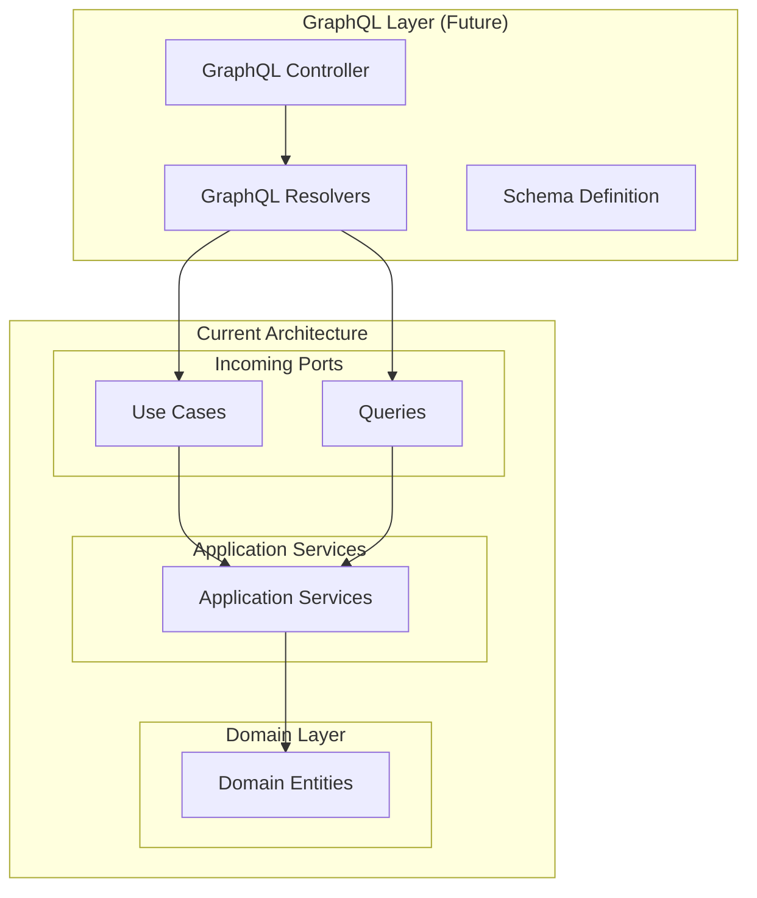

# GraphQL Schema 문서

## GraphQL 구현 현황

BuckPal 프로젝트는 **GraphQL을 사용하지 않으며**, **순수 REST API** 기반으로 구현되었습니다.

### 현재 상태 분석

```
❌ GraphQL 구성 요소가 없는 항목들:
├── GraphQL 의존성 없음      # spring-boot-starter-graphql 미포함
├── Schema 정의 파일 없음    # .graphqls, .gql 파일 없음
├── Resolver 클래스 없음     # @QueryMapping, @MutationMapping 없음
├── GraphQL Controller 없음  # GraphQL 엔드포인트 없음
└── GraphQL 설정 없음       # WebMvcConfigurer 설정 없음

✅ 현재 API 방식:
├── REST API              # Spring Web MVC 기반
├── JSON 응답/요청         # application/json
└── HTTP 표준 메서드       # GET, POST, PUT, DELETE
```

## GraphQL 도입 시 고려사항

BuckPal의 헥사고날 아키텍처는 GraphQL 도입을 용이하게 하는 구조를 가지고 있습니다.

### 헥사고날 아키텍처에서 GraphQL 통합



### 예상 GraphQL Schema 구조

BuckPal의 도메인을 기반으로 한 GraphQL Schema 예시:

#### Type Definitions

```graphql
# schema.graphqls (향후 구현 시)

"""
계좌 정보를 나타내는 타입
"""
type Account {
    """계좌 ID"""
    id: ID!
    
    """현재 잔액"""
    balance: Money!
    
    """계좌 생성일"""
    createdAt: String!
    
    """거래 내역 (페이징)"""
    activities(
        """조회할 페이지"""
        page: Int = 0
        
        """페이지 크기"""
        size: Int = 10
        
        """시작 날짜"""
        from: String
        
        """종료 날짜"""
        to: String
    ): ActivityConnection!
}

"""
금액을 나타내는 스칼라 타입
"""
scalar Money

"""
거래 활동을 나타내는 타입
"""
type Activity {
    """활동 ID"""
    id: ID!
    
    """소유 계좌"""
    ownerAccount: Account!
    
    """출금 계좌"""
    sourceAccount: Account!
    
    """입금 계좌"""
    targetAccount: Account!
    
    """거래 시각"""
    timestamp: String!
    
    """거래 금액"""
    money: Money!
    
    """거래 유형"""
    type: ActivityType!
}

"""
거래 유형 열거형
"""
enum ActivityType {
    """출금"""
    WITHDRAWAL
    
    """입금"""
    DEPOSIT
}

"""
거래 내역 연결 타입 (페이징)
"""
type ActivityConnection {
    """거래 목록"""
    edges: [ActivityEdge!]!
    
    """페이징 정보"""
    pageInfo: PageInfo!
    
    """전체 개수"""
    totalCount: Int!
}

"""
거래 내역 엣지"""
type ActivityEdge {
    """커서"""
    cursor: String!
    
    """거래 정보"""
    node: Activity!
}

"""
페이징 정보"""
type PageInfo {
    """다음 페이지 존재 여부"""
    hasNextPage: Boolean!
    
    """이전 페이지 존재 여부"""
    hasPreviousPage: Boolean!
    
    """시작 커서"""
    startCursor: String
    
    """종료 커서"""
    endCursor: String
}

"""
송금 결과"""
type SendMoneyResult {
    """성공 여부"""
    success: Boolean!
    
    """오류 메시지 (실패 시)"""
    errorMessage: String
    
    """업데이트된 계좌들"""
    updatedAccounts: [Account!]!
}

"""
송금 입력"""
input SendMoneyInput {
    """출금 계좌 ID"""
    sourceAccountId: ID!
    
    """입금 계좌 ID"""
    targetAccountId: ID!
    
    """송금 금액"""
    amount: Money!
}
```

#### Query 정의

```graphql
"""
조회 작업들
"""
type Query {
    """
    모든 계좌 조회
    """
    accounts(
        """페이지 번호"""
        page: Int = 0
        
        """페이지 크기"""
        size: Int = 10
    ): [Account!]!
    
    """
    특정 계좌 조회
    """
    account(
        """계좌 ID"""
        id: ID!
    ): Account
    
    """
    계좌 잔액 조회
    """
    accountBalance(
        """계좌 ID"""
        id: ID!
    ): Money
    
    """
    모든 거래 내역 조회
    """
    allActivities(
        """페이지 번호"""
        page: Int = 0
        
        """페이지 크기"""
        size: Int = 10
        
        """시작 날짜"""
        from: String
        
        """종료 날짜"""
        to: String
    ): ActivityConnection!
}
```

#### Mutation 정의

```graphql
"""
변경 작업들
"""
type Mutation {
    """
    계좌 간 송금
    """
    sendMoney(
        """송금 정보"""
        input: SendMoneyInput!
    ): SendMoneyResult!
    
    """
    새 계좌 생성
    """
    createAccount(
        """초기 잔액"""
        initialBalance: Money = 0
    ): Account!
}
```

#### Subscription 정의 (실시간 업데이트)

```graphql
"""
실시간 구독 작업들
"""
type Subscription {
    """
    계좌 잔액 변경 알림
    """
    accountBalanceChanged(
        """구독할 계좌 ID"""
        accountId: ID!
    ): Account!
    
    """
    새로운 거래 활동 알림
    """
    activityCreated(
        """구독할 계좌 ID (선택사항)"""
        accountId: ID
    ): Activity!
}
```

### GraphQL Resolver 구현 예시

BuckPal의 헥사고날 아키텍처와 통합된 Resolver 구현:

```java
// 향후 구현 시 예상 구조
@Controller
public class AccountGraphQLController {
    
    private final SendMoneyUseCase sendMoneyUseCase;
    private final GetAccountBalanceQuery getAccountBalanceQuery;
    private final LoadAccountPort loadAccountPort;
    
    // Query Resolvers
    @QueryMapping
    public List<Account> accounts(@Argument int page, @Argument int size) {
        // 페이징된 계좌 목록 조회 로직
        return accountQueryService.getAccounts(page, size);
    }
    
    @QueryMapping  
    public Account account(@Argument String id) {
        AccountId accountId = new AccountId(Long.parseLong(id));
        return loadAccountPort.loadAccount(accountId, LocalDateTime.now());
    }
    
    @QueryMapping
    public Money accountBalance(@Argument String id) {
        AccountId accountId = new AccountId(Long.parseLong(id));
        return getAccountBalanceQuery.getAccountBalance(accountId);
    }
    
    // Mutation Resolvers
    @MutationMapping
    public SendMoneyResult sendMoney(@Argument SendMoneyInput input) {
        try {
            SendMoneyCommand command = new SendMoneyCommand(
                new AccountId(Long.parseLong(input.sourceAccountId())),
                new AccountId(Long.parseLong(input.targetAccountId())),
                Money.of(input.amount())
            );
            
            boolean success = sendMoneyUseCase.sendMoney(command);
            
            return new SendMoneyResult(success, null, getUpdatedAccounts(command));
        } catch (Exception e) {
            return new SendMoneyResult(false, e.getMessage(), List.of());
        }
    }
    
    // Field Resolvers
    @SchemaMapping
    public ActivityConnection activities(Account account, 
                                       @Argument int page, 
                                       @Argument int size) {
        // 계좌별 거래 내역 조회 로직
        return activityQueryService.getActivitiesByAccount(account.getId(), page, size);
    }
}
```

### GraphQL 설정 클래스

```java
// 향후 구현 시 예상 구조
@Configuration
@EnableGraphQL
public class GraphQLConfig implements WebMvcConfigurer {
    
    @Bean
    public RuntimeWiring runtimeWiring() {
        return RuntimeWiring.newRuntimeWiring()
            .scalar(MoneyScalar.INSTANCE)
            .build();
    }
    
    @Bean
    public GraphQLScalarType moneyScalar() {
        return GraphQLScalarType.newScalar()
            .name("Money")
            .description("금액을 나타내는 사용자 정의 스칼라 타입")
            .coercing(new MoneyCoercing())
            .build();
    }
}
```

### GraphQL vs REST 비교

| 특징 | GraphQL (도입 시) | REST (현재) |
|------|------------------|-------------|
| **쿼리 유연성** | ✅ 클라이언트가 필요한 필드만 요청 | ❌ 고정된 응답 구조 |
| **Over/Under-fetching** | ✅ 없음 | ❌ 발생 가능 |
| **실시간 업데이트** | ✅ Subscription 지원 | ❌ 별도 WebSocket 필요 |
| **캐싱** | ❌ 복잡함 | ✅ HTTP 캐싱 활용 |
| **러닝 커브** | ❌ 높음 | ✅ 낮음 |
| **파일 업로드** | ❌ 복잡함 | ✅ 간단함 |

## GraphQL 도입 시 고려사항

### 1. 장점
- **단일 엔드포인트**: `/graphql` 하나로 모든 요청 처리
- **강타입 스키마**: TypeScript와 완벽한 통합
- **실시간 업데이트**: Subscription을 통한 실시간 잔액 업데이트
- **개발자 경험**: GraphQL Playground, Apollo DevTools

### 2. 단점
- **복잡성 증가**: 현재 단순한 API에 오버엔지니어링 가능
- **캐싱 어려움**: HTTP 캐싱 전략 활용 불가
- **보안 고려**: Query depth, complexity 제한 필요
- **성능 고려**: N+1 문제 해결 필요 (DataLoader 패턴)

### 3. 헥사고날 아키텍처와의 호환성
- ✅ **포트 재사용**: 기존 Use Case 인터페이스 그대로 활용 가능
- ✅ **어댑터 추가**: GraphQL Resolver가 새로운 인커밍 어댑터 역할
- ✅ **도메인 독립성**: GraphQL 도입이 비즈니스 로직에 영향 없음

**결론**: 현재 BuckPal은 단순한 도메인과 API로 인해 GraphQL 도입의 이점이 크지 않습니다. 하지만 헥사고날 아키텍처로 인해 향후 필요 시 쉽게 GraphQL을 추가할 수 있는 구조를 가지고 있습니다.