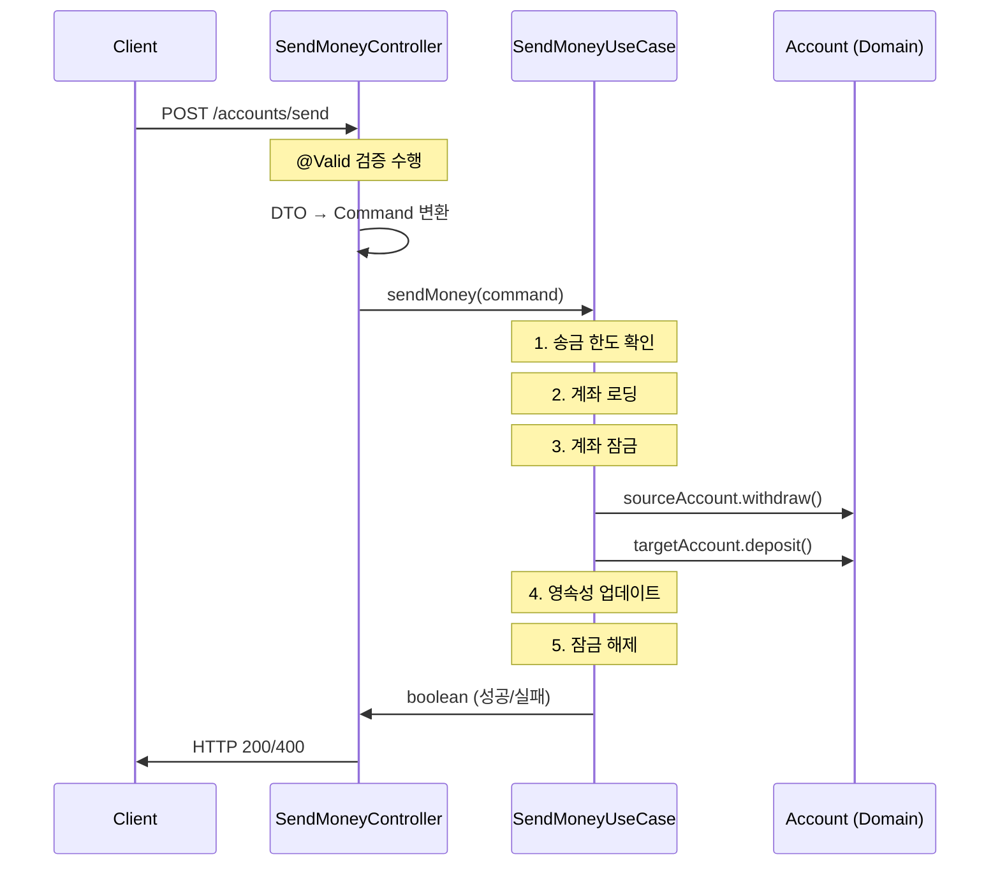

# REST API 엔드포인트 문서

## API 개요

BuckPal은 **단일 도메인 (계좌 송금)** 에 집중된 **미니멀한 REST API**를 제공합니다. 현재는 핵심 송금 기능만 구현되어 있으며, 헥사고날 아키텍처 패턴의 데모를 목적으로 합니다.

### API 버전 정보
- **현재 버전**: v1 (암묵적, URL 경로에 버전 정보 없음)
- **기본 URL**: `http://localhost:8080`
- **Content-Type**: `application/json`
- **인증**: 현재 구현되지 않음 (데모 애플리케이션)

## REST 엔드포인트 목록

### 💰 Account Management (계좌 관리)

| Method | Endpoint | Description | Auth Required | Controller Location |
|--------|----------|-------------|---------------|-------------------|
| POST | `/accounts/send` | 계좌 간 송금 실행 | ❌ No | `SendMoneyController.java:20` |

#### Spring Boot Actuator 엔드포인트

| Method | Endpoint | Description | Auth Required | Purpose |
|--------|----------|-------------|---------------|---------|
| GET | `/actuator/health` | 애플리케이션 상태 확인 | ❌ No | Health Check |
| GET | `/actuator/info` | 애플리케이션 정보 | ❌ No | Application Info |
| GET | `/actuator/*` | 기타 Actuator 엔드포인트들 | ❌ No | Monitoring |

## API 상세 분석

### 1. 송금 API - POST `/accounts/send`

**파일 위치**: `src/main/java/dev/haja/buckpal/account/adapter/in/web/SendMoneyController.java`

#### 요청 구조

```http
POST /accounts/send HTTP/1.1
Content-Type: application/json

{
    "sourceAccountId": 1,
    "targetAccountId": 2,
    "amount": 500
}
```

#### Request Body (SendMoneyReqDto)
**파일 위치**: `src/main/java/dev/haja/buckpal/account/adapter/in/web/SendMoneyReqDto.java`

| 필드명 | 타입 | 필수 | 검증 규칙 | 설명 |
|--------|------|------|-----------|------|
| `sourceAccountId` | Long | ✅ Yes | `@NotNull` | 출금할 계좌 ID |
| `targetAccountId` | Long | ✅ Yes | `@NotNull` | 입금받을 계좌 ID |
| `amount` | Long | ✅ Yes | `@NotNull`, `@Positive` | 송금할 금액 (원 단위) |

#### 검증 규칙 상세

```java
public record SendMoneyReqDto(
    @NotNull(message = "출금 계좌 ID는 필수입니다")
    Long sourceAccountId,

    @NotNull(message = "입금 계좌 ID는 필수입니다") 
    Long targetAccountId,

    @NotNull(message = "금액은 필수입니다")
    @Positive(message = "금액은 양수여야 합니다")
    Long amount
) {}
```

#### 응답 구조

**성공 응답 (200 OK)**
```http
HTTP/1.1 200 OK
Content-Length: 0

(응답 본문 없음)
```

**실패 응답 (400 Bad Request)**
```http
HTTP/1.1 400 Bad Request
Content-Length: 0

(응답 본문 없음)
```

#### 비즈니스 로직 처리 흐름



#### 에러 케이스

| 에러 상황 | HTTP 상태 | 발생 위치 | 설명 |
|----------|-----------|-----------|------|
| 입력값 검증 실패 | 400 Bad Request | Jakarta Validation | `@NotNull`, `@Positive` 위반 |
| 계좌 존재하지 않음 | 500 Internal Server Error | SendMoneyService | `IllegalStateException` 발생 |
| 잔액 부족 | 400 Bad Request | Account.withdraw() | 도메인 규칙 위반 |
| 송금 한도 초과 | 500 Internal Server Error | SendMoneyService | `ThresholdExceededException` 발생 |

#### 실제 호출 예시 (curl)

```bash
# 성공 케이스
curl -X POST http://localhost:8080/accounts/send \
  -H "Content-Type: application/json" \
  -d '{
    "sourceAccountId": 1,
    "targetAccountId": 2,
    "amount": 500
  }'

# 검증 실패 케이스 (음수 금액)
curl -X POST http://localhost:8080/accounts/send \
  -H "Content-Type: application/json" \
  -d '{
    "sourceAccountId": 1,
    "targetAccountId": 2,
    "amount": -500
  }'
```

#### 시스템 테스트 구현

**파일 위치**: `src/test/java/dev/haja/buckpal/SendMoneySystemTest.java`

```java
@Test
@DisplayName("sendMoney: 요청 생성 -> App에 보내고 응답상태와 계좌의 새로운 잔고를 검증")
@Sql("SendMoneySystemTest.sql")
void sendMoney() {
    // TestRestTemplate을 사용한 실제 HTTP 호출 테스트
    ResponseEntity<SendMoneyReqDto> responseEntity = 
        restTemplate.exchange("/accounts/send", HttpMethod.POST, reqEntity, SendMoneyReqDto.class);
    
    then(responseEntity.getStatusCode()).isEqualTo(HttpStatus.OK);
    // 잔액 변화 검증
}
```

## 부족한 API 엔드포인트 (향후 구현 필요)

### 계좌 관리 API (미구현)

| Method | Endpoint | Description | Priority |
|--------|----------|-------------|----------|
| GET | `/accounts` | 전체 계좌 목록 조회 | High |
| GET | `/accounts/{accountId}` | 특정 계좌 정보 조회 | High |
| GET | `/accounts/{accountId}/balance` | 계좌 잔액 조회 | High |
| GET | `/accounts/{accountId}/activities` | 거래 내역 조회 | Medium |
| POST | `/accounts` | 새 계좌 생성 | Medium |
| PUT | `/accounts/{accountId}` | 계좌 정보 수정 | Low |
| DELETE | `/accounts/{accountId}` | 계좌 삭제 | Low |

### 거래 내역 API (미구현)

| Method | Endpoint | Description | Priority |
|--------|----------|-------------|----------|
| GET | `/transactions` | 전체 거래 내역 | Medium |
| GET | `/transactions/{transactionId}` | 특정 거래 조회 | Medium |
| GET | `/transactions?from={date}&to={date}` | 기간별 거래 조회 | Medium |

### 시스템 관리 API (미구현)

| Method | Endpoint | Description | Priority |
|--------|----------|-------------|----------|
| GET | `/admin/config` | 시스템 설정 조회 | Low |
| PUT | `/admin/config/transfer-limit` | 송금 한도 설정 | Low |

## API 설계 원칙

### 1. RESTful 설계
- ✅ HTTP 메서드를 의미에 맞게 사용
- ✅ 상태 코드를 적절히 반환
- ❌ 리소스 중심 URL 구조 (현재 액션 중심)

### 2. 에러 처리
- ❌ 구체적 에러 메시지 없음 (HTTP 상태코드만)
- ❌ 글로벌 예외 처리 미구현
- ✅ Jakarta Validation 활용

### 3. 응답 구조
- ❌ 표준화된 응답 형식 없음
- ❌ 메타데이터 (timestamp, request ID 등) 없음
- ✅ 간단명료한 성공/실패 구분

## API 보안 고려사항 (미구현)

### 1. 인증/인가
```java
// 향후 구현 시 고려사항
@RestController
@PreAuthorize("hasRole('USER')")
public class SendMoneyController {
    
    @PostMapping("/accounts/send")
    @PreAuthorize("@accountSecurityService.canAccessAccount(#dto.sourceAccountId)")
    public ResponseEntity<Void> sendMoney(@Valid @RequestBody SendMoneyReqDto dto) {
        // 현재와 동일한 로직
    }
}
```

### 2. Rate Limiting
```java
// 향후 구현 시 고려사항
@RestController
@RateLimiter(name = "sendMoney", fallbackMethod = "rateLimitFallback")
public class SendMoneyController {
    // Rate limiting 적용
}
```

### 3. CORS 설정
```java
// 향후 프론트엔드 통합 시 필요
@CrossOrigin(origins = {"http://localhost:3000", "https://buckpal-frontend.com"})
@RestController
public class SendMoneyController {
    // CORS 헤더 자동 추가
}
```

## 개발 및 테스트 도구

### 1. API 문서화 도구 (권장)
```kotlin
// build.gradle.kts에 추가 권장
implementation("org.springdoc:springdoc-openapi-starter-webmvc-ui:2.2.0")
```

### 2. API 테스트 도구
- **Postman Collection**: 수동 테스트용
- **curl 스크립트**: CI/CD 통합 테스트
- **TestRestTemplate**: 시스템 테스트 (현재 구현됨)

이 API 설계는 헥사고날 아키텍처의 **포트 & 어댑터 패턴**을 충실히 구현하여, 비즈니스 로직과 웹 계층이 완전히 분리된 구조를 보여줍니다.