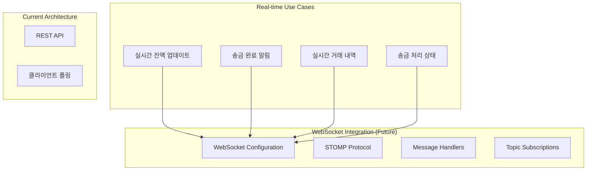
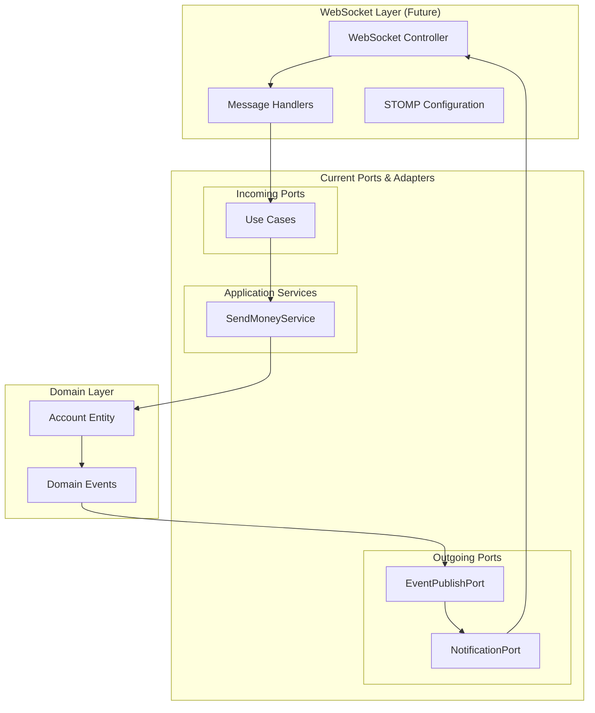

# WebSocket Events 문서

## WebSocket 구현 현황

BuckPal 프로젝트는 **WebSocket을 사용하지 않으며**, **동기식 HTTP 요청-응답** 패턴만을 사용합니다.

### 현재 상태 분석

```
❌ WebSocket 구성 요소가 없는 항목들:
├── WebSocket 의존성 없음      # spring-boot-starter-websocket 미포함
├── WebSocket 설정 없음        # WebSocketConfig 클래스 없음
├── Message Handler 없음       # @MessageMapping 어노테이션 없음
├── STOMP 설정 없음           # Simple Text Oriented Messaging Protocol
├── SockJS 설정 없음          # WebSocket fallback 없음
└── 실시간 기능 없음           # 푸시 알림, 실시간 업데이트 없음

✅ 현재 통신 방식:
├── HTTP Request-Response     # 동기식 통신
├── REST API                 # 상태 없는 통신
└── JSON 메시지 교환          # application/json
```

## WebSocket 도입 시 고려사항

BuckPal의 송금 도메인에서 WebSocket이 유용한 시나리오들을 분석해봅니다.

### 실시간 기능이 필요한 시나리오



### 예상 WebSocket 이벤트 구조

#### 클라이언트 → 서버 이벤트 (Inbound)

```json
// 계좌 잔액 구독 요청
{
    "type": "SUBSCRIBE_ACCOUNT_BALANCE",
    "payload": {
        "accountId": 1,
        "userId": "user123"
    },
    "timestamp": "2024-08-14T10:30:00Z",
    "requestId": "req_001"
}

// 송금 처리 상태 구독
{
    "type": "SUBSCRIBE_TRANSFER_STATUS", 
    "payload": {
        "transferId": "transfer_456",
        "userId": "user123"
    },
    "timestamp": "2024-08-14T10:31:00Z",
    "requestId": "req_002"
}

// 실시간 거래 내역 구독
{
    "type": "SUBSCRIBE_ACCOUNT_ACTIVITIES",
    "payload": {
        "accountId": 1,
        "userId": "user123"
    },
    "timestamp": "2024-08-14T10:32:00Z",
    "requestId": "req_003"
}
```

#### 서버 → 클라이언트 이벤트 (Outbound)

```json
// 잔액 변경 알림
{
    "type": "ACCOUNT_BALANCE_UPDATED",
    "payload": {
        "accountId": 1,
        "oldBalance": 1500,
        "newBalance": 1000,
        "lastActivity": {
            "id": "activity_789",
            "type": "WITHDRAWAL",
            "amount": 500,
            "timestamp": "2024-08-14T10:33:00Z"
        }
    },
    "timestamp": "2024-08-14T10:33:00Z"
}

// 송금 완료 알림
{
    "type": "TRANSFER_COMPLETED",
    "payload": {
        "transferId": "transfer_456",
        "sourceAccountId": 1,
        "targetAccountId": 2,
        "amount": 500,
        "status": "SUCCESS",
        "completedAt": "2024-08-14T10:33:00Z"
    },
    "timestamp": "2024-08-14T10:33:00Z"
}

// 새로운 거래 활동 알림
{
    "type": "NEW_ACTIVITY",
    "payload": {
        "activity": {
            "id": "activity_789",
            "ownerAccountId": 1,
            "sourceAccountId": 1,
            "targetAccountId": 2,
            "amount": 500,
            "type": "WITHDRAWAL",
            "timestamp": "2024-08-14T10:33:00Z"
        },
        "affectedBalance": 1000
    },
    "timestamp": "2024-08-14T10:33:00Z"
}

// 에러 알림
{
    "type": "ERROR",
    "payload": {
        "code": "INSUFFICIENT_BALANCE",
        "message": "잔액이 부족합니다",
        "requestId": "req_001",
        "details": {
            "accountId": 1,
            "requestedAmount": 2000,
            "availableBalance": 1000
        }
    },
    "timestamp": "2024-08-14T10:34:00Z"
}
```

### STOMP 토픽 구조

```
/topic/                          # 브로드캐스트 토픽
├── /account/{accountId}/balance     # 특정 계좌 잔액 변경
├── /account/{accountId}/activities  # 특정 계좌 거래 내역
├── /transfer/{transferId}/status    # 송금 처리 상태
└── /system/notifications           # 시스템 전체 알림

/user/                          # 사용자별 개인 토픽  
├── /queue/notifications            # 개인 알림
├── /queue/errors                  # 개인 에러 메시지
└── /queue/transfer-confirmations  # 송금 확인 메시지
```

## 헥사고날 아키텍처와 WebSocket 통합

### 아키텍처 확장 구조



### WebSocket 구현 예시 (향후)

#### WebSocket 설정 클래스

```java
@Configuration
@EnableWebSocketMessageBroker
public class WebSocketConfig implements WebSocketMessageBrokerConfigurer {
    
    @Override
    public void configureMessageBroker(MessageBrokerRegistry config) {
        // Simple broker 설정
        config.enableSimpleBroker("/topic", "/user");
        
        // 클라이언트에서 서버로 메시지 전송 시 사용할 prefix
        config.setApplicationDestinationPrefixes("/app");
        
        // 사용자별 개인 메시지용 prefix
        config.setUserDestinationPrefix("/user");
    }
    
    @Override
    public void registerStompEndpoints(StompEndpointRegistry registry) {
        // WebSocket 엔드포인트 등록
        registry.addEndpoint("/ws")
                .setAllowedOriginPatterns("*")
                .withSockJS();  // SockJS fallback 지원
    }
}
```

#### WebSocket Controller

```java
@Controller
public class AccountWebSocketController {
    
    private final SendMoneyUseCase sendMoneyUseCase;
    private final SimpMessagingTemplate messagingTemplate;
    private final GetAccountBalanceQuery getAccountBalanceQuery;
    
    /**
     * 계좌 잔액 구독 요청 처리
     */
    @MessageMapping("/account/balance/subscribe")
    public void subscribeToAccountBalance(
            @Payload AccountBalanceSubscriptionRequest request,
            SimpMessageHeaderAccessor headerAccessor) {
        
        // 사용자 세션 정보 저장
        String sessionId = headerAccessor.getSessionId();
        String accountId = request.getAccountId().toString();
        
        // 구독 정보 저장 (Redis 등에)
        subscriptionService.addSubscription(sessionId, "balance", accountId);
        
        // 현재 잔액 즉시 전송
        Money currentBalance = getAccountBalanceQuery.getAccountBalance(request.getAccountId());
        messagingTemplate.convertAndSendToUser(
            sessionId,
            "/queue/account/balance",
            new AccountBalanceUpdateEvent(request.getAccountId(), currentBalance)
        );
    }
    
    /**
     * 송금 실행 (WebSocket을 통한)
     */
    @MessageMapping("/transfer/send")
    public void sendMoneyViaWebSocket(
            @Payload SendMoneyWebSocketRequest request,
            SimpMessageHeaderAccessor headerAccessor) {
        
        String sessionId = headerAccessor.getSessionId();
        
        try {
            SendMoneyCommand command = new SendMoneyCommand(
                request.getSourceAccountId(),
                request.getTargetAccountId(),
                Money.of(request.getAmount())
            );
            
            boolean success = sendMoneyUseCase.sendMoney(command);
            
            // 결과를 요청자에게 전송
            messagingTemplate.convertAndSendToUser(
                sessionId,
                "/queue/transfer/result",
                new TransferResultEvent(success, request.getTransferId())
            );
            
        } catch (Exception e) {
            // 에러를 요청자에게 전송
            messagingTemplate.convertAndSendToUser(
                sessionId,
                "/queue/errors",
                new ErrorEvent("TRANSFER_FAILED", e.getMessage())
            );
        }
    }
}
```

#### 도메인 이벤트 발행

```java
@Component
public class AccountEventPublisher {
    
    private final SimpMessagingTemplate messagingTemplate;
    
    /**
     * 잔액 변경 이벤트 발행
     */
    @EventListener
    public void handleAccountBalanceChanged(AccountBalanceChangedEvent event) {
        
        // 특정 계좌를 구독하는 모든 사용자에게 브로드캐스트
        messagingTemplate.convertAndSend(
            "/topic/account/" + event.getAccountId() + "/balance",
            new AccountBalanceUpdateEvent(
                event.getAccountId(),
                event.getNewBalance(),
                event.getLastActivity()
            )
        );
    }
    
    /**
     * 새로운 거래 활동 이벤트 발행
     */
    @EventListener  
    public void handleNewActivity(NewActivityEvent event) {
        
        // 관련 계좌들을 구독하는 사용자들에게 알림
        List<AccountId> affectedAccounts = List.of(
            event.getActivity().getSourceAccountId(),
            event.getActivity().getTargetAccountId()
        );
        
        for (AccountId accountId : affectedAccounts) {
            messagingTemplate.convertAndSend(
                "/topic/account/" + accountId + "/activities",
                new NewActivityNotification(event.getActivity())
            );
        }
    }
}
```

### WebSocket 클라이언트 예시 (JavaScript)

```javascript
// WebSocket 연결 및 구독
class BuckpalWebSocketClient {
    constructor() {
        this.client = null;
        this.subscriptions = new Map();
    }
    
    connect() {
        const socket = new SockJS('/ws');
        this.client = Stomp.over(socket);
        
        this.client.connect({}, (frame) => {
            console.log('Connected to WebSocket:', frame);
            this.setupSubscriptions();
        });
    }
    
    // 계좌 잔액 구독
    subscribeToAccountBalance(accountId, callback) {
        const subscription = this.client.subscribe(
            `/topic/account/${accountId}/balance`,
            (message) => {
                const balanceUpdate = JSON.parse(message.body);
                callback(balanceUpdate);
            }
        );
        
        this.subscriptions.set(`balance_${accountId}`, subscription);
        
        // 구독 요청 전송
        this.client.send('/app/account/balance/subscribe', {}, JSON.stringify({
            accountId: accountId
        }));
    }
    
    // 실시간 거래 내역 구독
    subscribeToAccountActivities(accountId, callback) {
        const subscription = this.client.subscribe(
            `/topic/account/${accountId}/activities`,
            (message) => {
                const newActivity = JSON.parse(message.body);
                callback(newActivity);
            }
        );
        
        this.subscriptions.set(`activities_${accountId}`, subscription);
    }
    
    // WebSocket을 통한 송금
    sendMoney(sourceAccountId, targetAccountId, amount) {
        const transferRequest = {
            transferId: this.generateTransferId(),
            sourceAccountId: sourceAccountId,
            targetAccountId: targetAccountId,
            amount: amount
        };
        
        this.client.send('/app/transfer/send', {}, JSON.stringify(transferRequest));
    }
    
    // 구독 해제
    unsubscribe(subscriptionKey) {
        const subscription = this.subscriptions.get(subscriptionKey);
        if (subscription) {
            subscription.unsubscribe();
            this.subscriptions.delete(subscriptionKey);
        }
    }
    
    disconnect() {
        if (this.client) {
            this.client.disconnect();
        }
    }
}
```

## WebSocket vs REST 비교

| 특징 | WebSocket (도입 시) | REST (현재) |
|------|-------------------|-------------|
| **통신 방식** | ✅ 양방향, 실시간 | ❌ 단방향, 요청-응답 |
| **연결 유지** | ✅ 지속적 연결 | ❌ 무상태 연결 |
| **실시간 업데이트** | ✅ 즉시 푸시 | ❌ 클라이언트 폴링 필요 |
| **서버 리소스** | ❌ 연결 유지 비용 | ✅ 요청시만 리소스 사용 |
| **캐싱** | ❌ 어려움 | ✅ HTTP 캐싱 활용 |
| **디버깅** | ❌ 복잡함 | ✅ 간단함 |
| **확장성** | ❌ 연결 수 제한 | ✅ 무상태로 확장 용이 |

## WebSocket 도입 시 고려사항

### 1. 장점
- **실시간 성능**: 잔액 변경, 거래 완료 즉시 알림
- **사용자 경험**: 새로고침 없이 실시간 업데이트
- **효율성**: 폴링 대비 네트워크 트래픽 감소

### 2. 단점  
- **복잡성 증가**: 현재 단순한 송금 API에 오버엔지니어링
- **상태 관리**: 연결 상태, 구독 정보 관리 필요
- **확장성 제약**: 동시 연결 수 제한
- **인프라 비용**: 지속적 연결 유지 비용

### 3. 적합한 시나리오
- 👍 **다중 사용자 환경**: 여러 사용자가 동일 계좌 모니터링
- 👍 **실시간 대시보드**: 관리자용 실시간 모니터링
- 👍 **모바일 앱**: 푸시 알림 대체
- 👎 **단순 송금**: 현재처럼 단발성 거래는 REST가 적합

**결론**: 현재 BuckPal의 단순한 송금 도메인에서는 WebSocket의 필요성이 크지 않지만, 향후 실시간 모니터링이나 다중 사용자 기능 추가 시 유용할 수 있습니다. 헥사고날 아키텍처로 인해 WebSocket 도입 시에도 기존 비즈니스 로직에 영향 없이 새로운 어댑터로 추가 가능합니다.