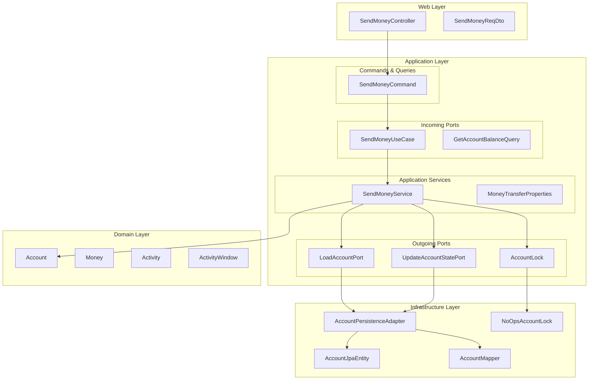
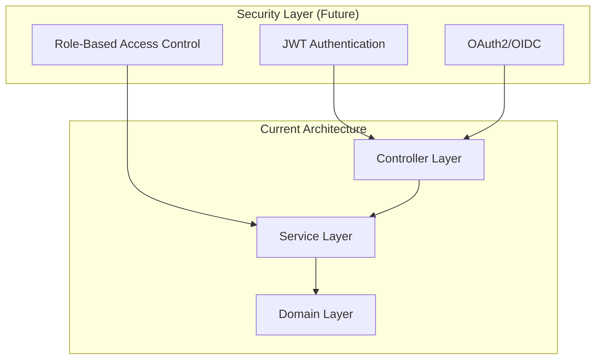
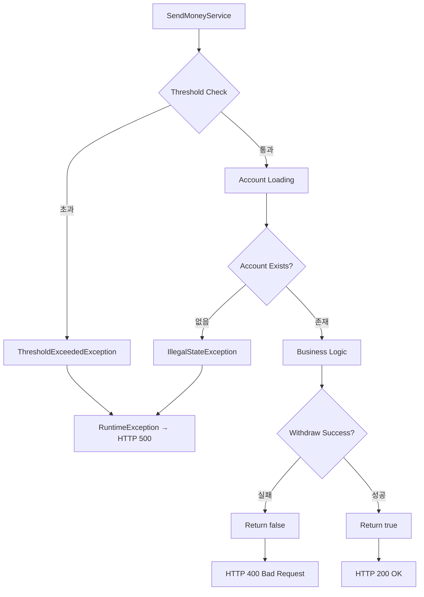

# 백엔드 아키텍처 심층 분석

## 백엔드 서버 구조

BuckPal의 백엔드는 **Spring Boot** 기반의 헥사고날 아키텍처로 구성되어 있으며, 전통적인 계층형 아키텍처 대신 **포트 & 어댑터 패턴**을 적용하고 있습니다.

### 전체 백엔드 구조



## 주요 컴포넌트 분석

### 1. 컨트롤러 계층 (Web Controllers)

**위치**: `src/main/java/dev/haja/buckpal/account/adapter/in/web/`

#### SendMoneyController 분석
```java
@RestController
@RequiredArgsConstructor
class SendMoneyController {
    private final SendMoneyUseCase sendMoneyUseCase;

    @PostMapping(path = "/accounts/send")
    ResponseEntity<Void> sendMoney(@Valid @RequestBody SendMoneyReqDto dto) {
        // DTO → Command 변환
        SendMoneyCommand command = new SendMoneyCommand(
            new AccountId(dto.sourceAccountId()),
            new AccountId(dto.targetAccountId()),
            Money.of(dto.amount())
        );
        
        // 유스케이스 실행
        boolean success = sendMoneyUseCase.sendMoney(command);
        
        // HTTP 응답 생성
        return success ? ResponseEntity.ok().build() 
                      : ResponseEntity.badRequest().build();
    }
}
```

**특징**:
- **단일 책임**: 웹 요청을 도메인 명령으로 변환
- **얇은 컨트롤러**: 비즈니스 로직 없음
- **포트 의존**: 인터페이스에만 의존 (구현체 무관)

### 2. 애플리케이션 서비스 계층

#### 유스케이스 인터페이스 (Incoming Ports)

**SendMoneyUseCase** - `src/main/java/dev/haja/buckpal/account/application/port/in/`
```java
public interface SendMoneyUseCase {
    boolean sendMoney(SendMoneyCommand command);
}
```

**GetAccountBalanceQuery** - 조회 전용 포트
```java
public interface GetAccountBalanceQuery {
    Money getAccountBalance(AccountId accountId);
}
```

#### 애플리케이션 서비스 구현체

**SendMoneyService** - `src/main/java/dev/haja/buckpal/account/application/service/`
```java
@Component
@RequiredArgsConstructor
@Transactional
public class SendMoneyService implements SendMoneyUseCase {
    
    private final LoadAccountPort loadAccountPort;
    private final AccountLock accountLock;
    private final UpdateAccountStatePort updateAccountStatePort;
    private final MoneyTransferProperties moneyTransferProperties;
    
    @Override
    public boolean sendMoney(SendMoneyCommand command) {
        // 1. 송금 한도 검증
        checkThreshold(command);
        
        // 2. 계좌 로딩
        Account sourceAccount = loadAccount(command.getSourceAccountId(), baselineDate);
        Account targetAccount = loadAccount(command.getTargetAccountId(), baselineDate);
        
        // 3. 송금 실행 (도메인 로직 호출)
        return executeMoneyTransfer(command, sourceAccount, targetAccount);
    }
    
    private boolean executeMoneyTransfer(...) {
        // 동시성 제어
        accountLock.lockAccount(sourceAccountId);
        
        // 도메인 로직 실행
        boolean withdrawal = sourceAccount.withdraw(command.getMoney(), targetAccountId);
        boolean deposit = targetAccount.deposit(command.getMoney(), sourceAccountId);
        
        // 영속성 업데이트
        updateAccountStates(sourceAccount, targetAccount);
        
        // 락 해제
        accountLock.releaseAccount(sourceAccountId);
        return withdrawal && deposit;
    }
}
```

## 미들웨어 체인과 처리 파이프라인

### Spring Boot 자동 구성 미들웨어

```mermaid
graph LR
    REQUEST[HTTP Request] 
    --> FILTER[Spring Security Filters]
    --> SERVLET[DispatcherServlet]
    --> HANDLER[HandlerMapping]
    --> INTERCEPTOR[HandlerInterceptor]
    --> CONTROLLER[Controller Method]
    --> VALIDATION[Bean Validation]
    --> SERVICE[Application Service]
    --> RESPONSE[HTTP Response]
```



#### 주요 미들웨어 구성

1. **Bean Validation 미들웨어**
   - `@Valid` 어노테이션 처리
   - SendMoneyReqDto 유효성 검증
   - ConstraintViolationException 자동 발생

2. **Transaction 미들웨어**
   - `@Transactional` 어노테이션 처리
   - 자동 롤백 (RuntimeException 발생 시)

3. **Exception Handling 미들웨어**
   - Spring Boot 기본 예외 처리
   - ResponseEntity 자동 변환

### 커스텀 검증 체인

**SelfValidating 패턴** - `src/main/java/dev/haja/buckpal/common/SelfValidating.java`
```java
public abstract class SelfValidating<T> {
    protected void validateSelf() {
        Set<ConstraintViolation<T>> violations = validator.validate((T) this);
        if (!violations.isEmpty()) {
            throw new ConstraintViolationException(violations);
        }
    }
}
```

**SendMoneyCommand의 검증 체인**:
1. **생성자 검증**: 도메인 불변성 규칙 확인
2. **Bean Validation**: `@NotNull` 어노테이션 검증
3. **Self Validation**: `validateSelf()` 호출
4. **비즈니스 규칙**: 양수 금액 확인

## 인증/인가 메커니즘

### 현재 구현 상태
BuckPal은 **인증/인가가 구현되지 않은** 데모 애플리케이션입니다.

### 예상 확장 방향



#### 확장 시 고려사항

```java
// 인증이 적용된다면 예상 구조
@RestController
@PreAuthorize("hasRole('ACCOUNT_MANAGER')")
class SendMoneyController {
    
    @PostMapping("/accounts/send")
    @PreAuthorize("@accountSecurityService.canAccessAccount(#dto.sourceAccountId)")
    ResponseEntity<Void> sendMoney(@Valid @RequestBody SendMoneyReqDto dto) {
        // 현재와 동일한 로직
    }
}
```

## 에러 처리 전략

### 1. 계층별 예외 처리

#### 도메인 계층 예외
```java
// 비즈니스 규칙 위반
public class ThresholdExceededException extends RuntimeException {
    public ThresholdExceededException(Money threshold, Money actual) {
        super(String.format("최대 송금 한도 초과: %s 전송을 시도했으나 임계값이 %s!", 
                           actual, threshold));
    }
}
```

#### 애플리케이션 계층 예외
```java
// 설정 오류
if (historyLookbackDays <= 0) {
    throw new IllegalArgumentException(
        "historyLookbackDays must be positive, but was: " + historyLookbackDays);
}

// 계좌 존재하지 않음
throw new IllegalStateException(
    String.format("%s ID가 비어있습니다.", accountDescription));
```

#### Command 검증 예외
```java
// SendMoneyCommand 생성자에서
if (!money.isPositiveOrZero()) {
    throw new IllegalArgumentException(
        "The money amount must be greater than or equal to zero");
}
```

### 2. 예외 처리 흐름



### 3. 글로벌 에러 처리 (확장 가능성)

```java
// 향후 추가 가능한 GlobalExceptionHandler
@ControllerAdvice
public class GlobalExceptionHandler {
    
    @ExceptionHandler(ThresholdExceededException.class)
    public ResponseEntity<ErrorResponse> handleThresholdExceeded(
            ThresholdExceededException ex) {
        return ResponseEntity.badRequest()
            .body(new ErrorResponse("THRESHOLD_EXCEEDED", ex.getMessage()));
    }
    
    @ExceptionHandler(ConstraintViolationException.class)
    public ResponseEntity<ErrorResponse> handleValidation(
            ConstraintViolationException ex) {
        return ResponseEntity.badRequest()
            .body(new ErrorResponse("VALIDATION_ERROR", "Invalid input"));
    }
}
```

## 주요 비즈니스 로직 위치와 패턴

### 1. 도메인 중심 비즈니스 로직

**Account.java** - 핵심 비즈니스 규칙
```java
// 위치: src/main/java/dev/haja/buckpal/account/domain/Account.java
public boolean withdraw(Money money, AccountId targetAccountId) {
    // 비즈니스 규칙: 출금 가능 여부 검증
    if (!mayWithdraw(money)) return false;
    
    // 도메인 이벤트 생성
    Activity withdrawal = new Activity(/*...*/);
    this.activityWindow.addActivity(withdrawal);
    return true;
}

private boolean mayWithdraw(Money money) {
    // 핵심 비즈니스 로직: 잔액 검증
    return Money.add(this.calculateBalance(), money.negate())
                .isPositiveOrZero();
}
```

### 2. 애플리케이션 서비스의 오케스트레이션

**SendMoneyService.java** - 유스케이스 조정
```java
// 위치: src/main/java/dev/haja/buckpal/account/application/service/
private boolean executeMoneyTransfer(...) {
    // 1. 동시성 제어
    accountLock.lockAccount(sourceAccountId);
    accountLock.lockAccount(targetAccountId);
    
    // 2. 도메인 로직 실행 (위임)
    if (!sourceAccount.withdraw(command.getMoney(), targetAccountId)) {
        return false;
    }
    if (!targetAccount.deposit(command.getMoney(), sourceAccountId)) {
        return false;
    }
    
    // 3. 영속성 처리
    updateAccountStates(sourceAccount, targetAccount);
    
    // 4. 리소스 정리
    releaseLock(sourceAccountId, targetAccountId);
    return true;
}
```

### 3. 비즈니스 패턴 적용

#### Command Pattern
- **SendMoneyCommand**: 요청을 객체로 캡슐화
- **Self-Validating**: 명령 객체가 스스로 검증

#### Repository Pattern  
- **LoadAccountPort/UpdateAccountStatePort**: 데이터 접근 추상화
- **AccountPersistenceAdapter**: 구체적 구현

#### Factory Pattern
- **Account.withId()**: 영속성에서 로드된 계좌 생성
- **Account.withoutId()**: 새 계좌 생성
- **Money.of()**: 값 객체 생성

#### Strategy Pattern
- **AccountLock**: 다양한 락 구현체 교체 가능
- **NoOpsAccountLock**: 현재는 아무것도 하지 않는 구현체

### 4. 트랜잭션 관리

```java
@Component
@RequiredArgsConstructor
@Transactional  // 메서드 레벨 트랜잭션
public class SendMoneyService implements SendMoneyUseCase {
    
    @Override
    public boolean sendMoney(SendMoneyCommand command) {
        // 모든 작업이 하나의 트랜잭션에서 실행
        // RuntimeException 발생 시 자동 롤백
    }
}
```

**트랜잭션 경계**:
- **시작점**: SendMoneyService.sendMoney() 진입
- **커밋 점**: 메서드 정상 종료
- **롤백 점**: RuntimeException 발생 시

이러한 백엔드 아키텍처는 헥사고날 패턴을 충실히 구현하여 비즈니스 로직을 순수하게 유지하면서도, Spring Boot의 강력한 기능들을 효과적으로 활용하고 있습니다.