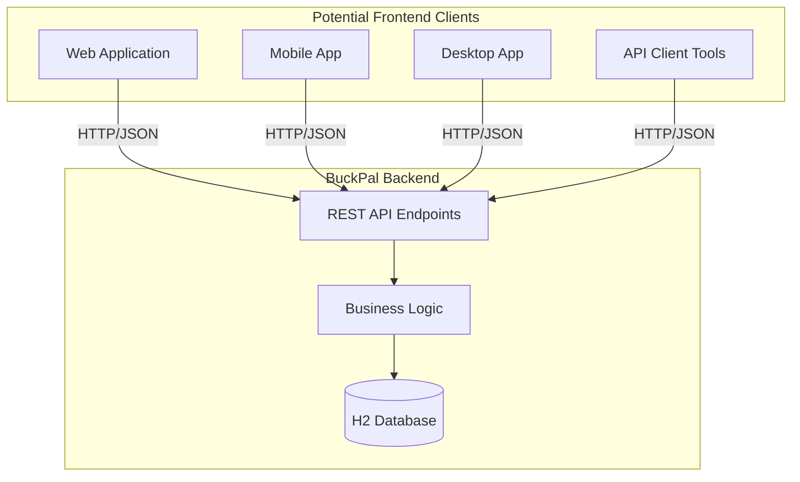
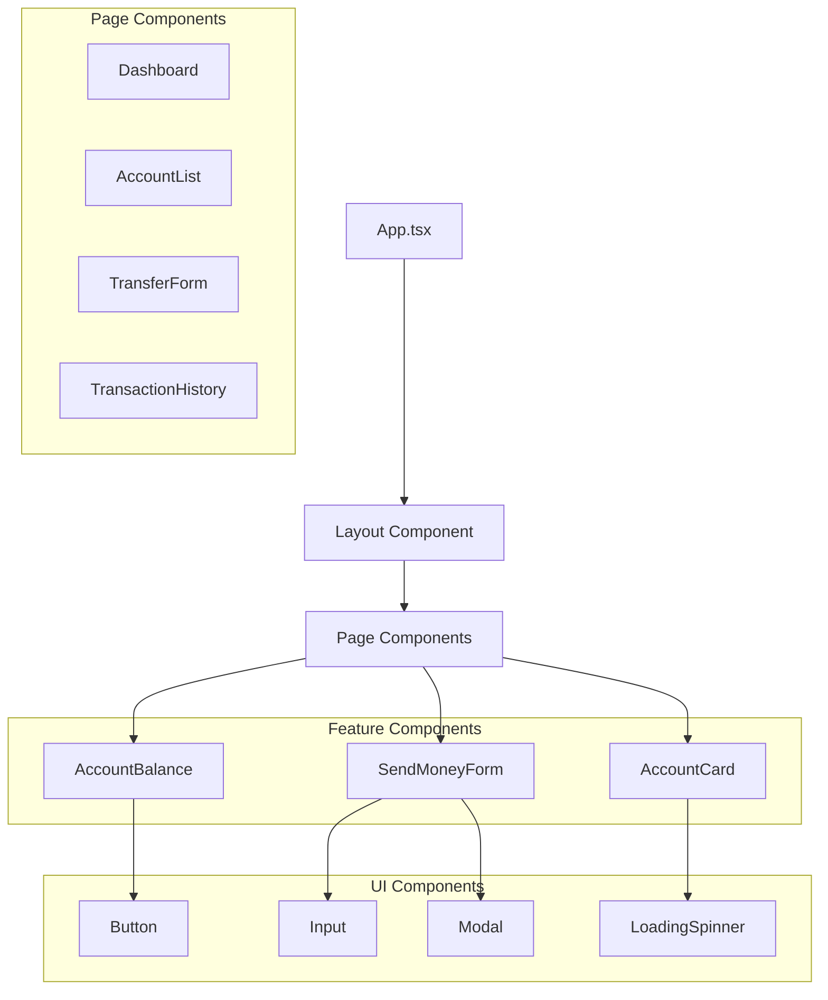

# 프론트엔드 아키텍처 분석

## 프론트엔드 구성 현황

BuckPal 프로젝트는 **백엔드 중심의 REST API 서버**로, **별도의 프론트엔드 애플리케이션이 포함되어 있지 않습니다**.

### 현재 상태 분석

```
❌ 프론트엔드 구성 요소가 없는 항목들:
├── package.json        # Node.js 프로젝트 없음
├── HTML 템플릿        # Thymeleaf, JSP 등 없음  
├── JavaScript/CSS     # 정적 리소스 없음
├── React/Vue/Angular  # SPA 프레임워크 없음
└── 웹 UI             # 사용자 인터페이스 없음

✅ 존재하는 리소스:
├── application*.yml   # Spring Boot 설정 파일
├── banner.txt        # 애플리케이션 시작 배너
└── 테스트 SQL 스크립트  # 데이터베이스 초기화
```

## API 기반 아키텍처

BuckPal은 **헤드리스(Headless) 백엔드** 구조로, 다양한 클라이언트와 통합 가능하도록 설계되었습니다.

### 클라이언트-서버 아키텍처



### 현재 제공하는 API

**송금 API**: `POST /accounts/send`
```json
{
    "sourceAccountId": 1,
    "targetAccountId": 2,
    "amount": 500
}
```

## 프론트엔드 구현 시 고려사항

### 1. 추천 기술 스택

#### React 기반 구현 예시

```typescript
// 프로젝트 구조 (구현 시)
src/
├── components/
│   ├── Account/
│   │   ├── AccountBalance.tsx
│   │   ├── AccountList.tsx
│   │   └── TransferForm.tsx
│   └── Common/
│       ├── Header.tsx
│       └── ErrorBoundary.tsx
├── services/
│   └── api.ts
├── hooks/
│   ├── useAccount.ts
│   └── useTransfer.ts
├── types/
│   └── api.types.ts
└── App.tsx
```

#### API 서비스 계층
```typescript
// services/api.ts
export interface SendMoneyRequest {
  sourceAccountId: number;
  targetAccountId: number;
  amount: number;
}

export class BuckpalApiService {
  private baseUrl = 'http://localhost:8080';
  
  async sendMoney(request: SendMoneyRequest): Promise<boolean> {
    const response = await fetch(`${this.baseUrl}/accounts/send`, {
      method: 'POST',
      headers: {
        'Content-Type': 'application/json',
      },
      body: JSON.stringify(request),
    });
    
    return response.ok;
  }
  
  async getAccountBalance(accountId: number): Promise<number> {
    // 향후 구현될 API 호출
    const response = await fetch(`${this.baseUrl}/accounts/${accountId}/balance`);
    const data = await response.json();
    return data.balance;
  }
}
```

### 2. 상태 관리 패턴 고려사항

#### Zustand를 활용한 상태 관리 (추천)
```typescript
// stores/accountStore.ts
interface AccountState {
  accounts: Account[];
  currentBalance: number;
  loading: boolean;
  error: string | null;
  
  // Actions
  fetchAccounts: () => Promise<void>;
  sendMoney: (request: SendMoneyRequest) => Promise<boolean>;
  updateBalance: (accountId: number) => Promise<void>;
}

export const useAccountStore = create<AccountState>((set, get) => ({
  accounts: [],
  currentBalance: 0,
  loading: false,
  error: null,
  
  fetchAccounts: async () => {
    set({ loading: true });
    try {
      const accounts = await api.getAccounts();
      set({ accounts, loading: false });
    } catch (error) {
      set({ error: error.message, loading: false });
    }
  },
  
  sendMoney: async (request) => {
    const success = await api.sendMoney(request);
    if (success) {
      // 잔액 업데이트
      await get().updateBalance(request.sourceAccountId);
      await get().updateBalance(request.targetAccountId);
    }
    return success;
  },
  
  updateBalance: async (accountId) => {
    const balance = await api.getAccountBalance(accountId);
    set({ currentBalance: balance });
  }
}));
```

### 3. 라우팅 구조 (React Router)

```typescript
// App.tsx
import { BrowserRouter, Routes, Route } from 'react-router-dom';

function App() {
  return (
    <BrowserRouter>
      <Routes>
        <Route path="/" element={<Dashboard />} />
        <Route path="/accounts" element={<AccountList />} />
        <Route path="/accounts/:id" element={<AccountDetail />} />
        <Route path="/transfer" element={<TransferForm />} />
        <Route path="/history" element={<TransactionHistory />} />
      </Routes>
    </BrowserRouter>
  );
}
```

### 4. 컴포넌트 계층 구조



## 백엔드 API 확장 필요사항

### 현재 부족한 API 엔드포인트

```typescript
// 프론트엔드 구현을 위해 필요한 추가 API들
interface RequiredAPIs {
  // 계좌 관리
  'GET /accounts': Account[];
  'GET /accounts/{id}': Account;
  'GET /accounts/{id}/balance': { balance: number };
  
  // 거래 내역
  'GET /accounts/{id}/transactions': Transaction[];
  'GET /accounts/{id}/transactions?from={date}&to={date}': Transaction[];
  
  // 계좌 생성/수정 (관리자용)
  'POST /accounts': Account;
  'PUT /accounts/{id}': Account;
  
  // 시스템 정보
  'GET /health': HealthStatus;
  'GET /info': ApplicationInfo;
}
```

### CORS 설정 필요

```java
// 백엔드에 추가 필요한 CORS 설정
@Configuration
public class WebConfig implements WebMvcConfigurer {
    
    @Override
    public void addCorsMappings(CorsRegistry registry) {
        registry.addMapping("/accounts/**")
                .allowedOrigins("http://localhost:3000", "https://buckpal-frontend.com")
                .allowedMethods("GET", "POST", "PUT", "DELETE", "OPTIONS")
                .allowedHeaders("*")
                .allowCredentials(true);
    }
}
```

## 스타일링 전략 권장사항

### 1. Tailwind CSS (권장)
- **유틸리티 퍼스트**: 빠른 개발 및 일관된 디자인
- **반응형 디자인**: 모바일 우선 접근법
- **컴포넌트 기반**: 재사용 가능한 UI 컴포넌트

```tsx
// TransferForm.tsx 예시
export function TransferForm() {
  return (
    <form className="max-w-md mx-auto bg-white shadow-lg rounded-lg p-6">
      <h2 className="text-2xl font-bold text-gray-800 mb-6">송금하기</h2>
      
      <div className="mb-4">
        <label className="block text-sm font-medium text-gray-700 mb-2">
          출금 계좌
        </label>
        <select className="w-full px-3 py-2 border border-gray-300 rounded-md focus:outline-none focus:ring-2 focus:ring-blue-500">
          {/* 계좌 옵션들 */}
        </select>
      </div>
      
      <div className="mb-6">
        <label className="block text-sm font-medium text-gray-700 mb-2">
          송금 금액
        </label>
        <input 
          type="number"
          className="w-full px-3 py-2 border border-gray-300 rounded-md focus:outline-none focus:ring-2 focus:ring-blue-500"
          placeholder="금액을 입력하세요"
        />
      </div>
      
      <button className="w-full bg-blue-600 text-white py-2 px-4 rounded-md hover:bg-blue-700 transition-colors">
        송금하기
      </button>
    </form>
  );
}
```

### 2. CSS Modules (대안)
- **스코프 격리**: 컴포넌트별 스타일 충돌 방지
- **번들 최적화**: 사용되지 않는 CSS 제거

## 개발 환경 설정

### Create React App 기반 설정
```bash
# 프론트엔드 프로젝트 생성
npx create-react-app buckpal-frontend --template typescript
cd buckpal-frontend

# 필요한 의존성 설치
npm install @tanstack/react-query zustand react-router-dom
npm install -D tailwindcss @types/react @types/react-dom

# 개발 서버 시작 (백엔드와 동시 실행)
npm start  # http://localhost:3000
```

### 프록시 설정 (package.json)
```json
{
  "name": "buckpal-frontend",
  "version": "0.1.0",
  "proxy": "http://localhost:8080",
  "dependencies": {
    // ...
  }
}
```

## 배포 전략

### 정적 파일 서빙 옵션

1. **Nginx 정적 호스팅** (권장)
2. **Spring Boot 정적 리소스** 통합
3. **CDN 배포** (AWS CloudFront, Vercel 등)

```nginx
# nginx.conf 예시
server {
    listen 80;
    server_name buckpal.example.com;
    
    # 프론트엔드 정적 파일
    location / {
        root /var/www/buckpal-frontend/build;
        try_files $uri $uri/ /index.html;
    }
    
    # 백엔드 API 프록시
    location /accounts {
        proxy_pass http://localhost:8080;
        proxy_set_header Host $host;
        proxy_set_header X-Real-IP $remote_addr;
    }
}
```

**결론**: 현재 BuckPal은 순수 백엔드 API 서버이며, 프론트엔드 구현 시에는 RESTful API를 소비하는 SPA 형태로 구현하는 것이 적합합니다.