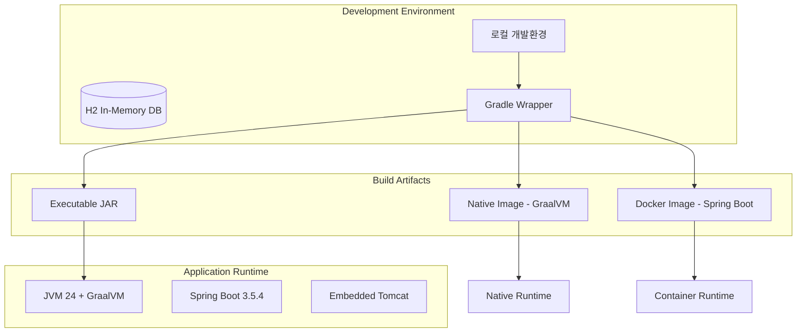
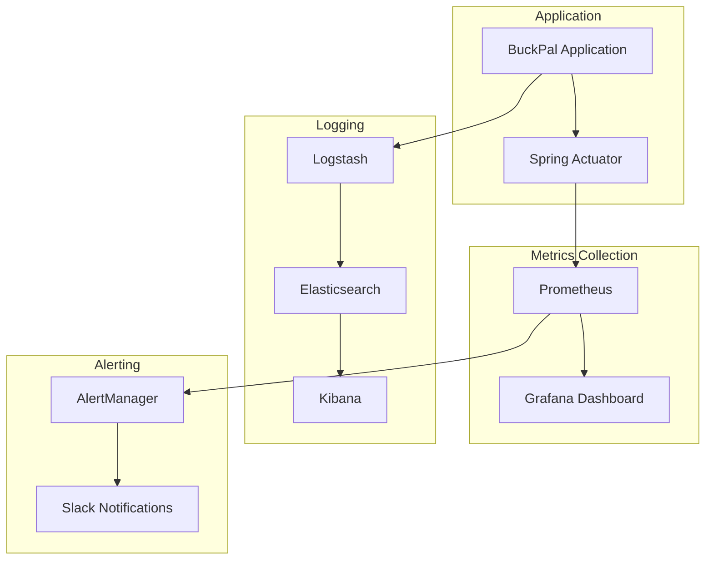

# 인프라스트럭처 아키텍처

## 서버 환경 및 배포 구조

BuckPal은 **Spring Boot 기반의 모놀리식 애플리케이션**으로, 다양한 배포 옵션을 제공하는 현대적인 인프라스트럭처를 지원합니다.

### 현재 배포 구조



## 환경별 설정 관리

### Spring Profiles 기반 구성

**기본 설정**: `application.yml`
```yaml
spring:
  profiles:
    active: local
  application:
    name: Get-your-hands-dirty-on-clean-architecture

buckpal:
  account:
    history-lookback-days: 10
```

**로컬 개발환경**: `application-local.yml`
```yaml
spring:
  jpa:
    hibernate:
      ddl-auto: create-drop  # 애플리케이션 재시작시 스키마 재생성
    properties:
      hibernate:
        show_sql: false      # SQL 출력 비활성화 (로거 사용)
        format_sql: true     # SQL 포맷팅
        use_sql_comments: true  # 쿼리 주석 포함

# 개발용 디버그 로깅
logging.level:
  org.hibernate.SQL: debug     # SQL 쿼리 로그
  org.hibernate.type: trace    # 쿼리 파라미터 로그
```

**운영환경**: `application-prod.yml`
```yaml
spring:
  jpa:
    hibernate:
      ddl-auto: validate     # 스키마 검증만 (운영 안전성)
    properties:
      hibernate:
        show_sql: false
        format_sql: false    # 성능 최적화
        use_sql_comments: false

# 운영용 로깅 레벨
logging.level:
  org.hibernate.SQL: warn     # 경고 이상만 로그
  org.hibernate.type: off     # 파라미터 로그 비활성화
```

### 환경변수 기반 설정

```bash
# 환경변수로 프로파일 전환
export SPRING_PROFILES_ACTIVE=prod

# JVM 옵션 설정 (gradle.properties에서)
JAVA_OPTS="-Dfile.encoding=UTF-8 -Duser.timezone=Asia/Seoul"
```

## 배포 옵션 분석

### 1. JAR 기반 배포 (기본)

```bash
# 빌드 및 실행
./gradlew bootJar
java -jar build/libs/Get-your-hands-dirty-on-clean-architecture-*.jar

# 프로파일 지정 실행
java -Dspring.profiles.active=prod -jar build/libs/*.jar
```

**장점**:
- 간단한 배포 프로세스
- JVM 생태계의 모든 기능 활용
- 풍부한 모니터링 도구 지원

**단점**:
- 상대적으로 큰 메모리 사용량
- 시작 시간이 네이티브 이미지보다 느림

### 2. GraalVM 네이티브 이미지 배포

```bash
# 네이티브 이미지 컴파일
./gradlew nativeCompile

# 실행
./build/native/nativeCompile/Get-your-hands-dirty-on-clean-architecture
```

**빌드 구성** (build.gradle.kts):
```kotlin
plugins {
    id("org.graalvm.buildtools.native") version "0.10.6"
}

// 네이티브 이미지 설정
graalvmNative {
    binaries {
        named("main") {
            buildArgs.add("--initialize-at-build-time")
            buildArgs.add("--no-fallback")
        }
    }
}
```

**장점**:
- 빠른 시작 시간
- 낮은 메모리 사용량  
- 서버리스/컨테이너 환경에 최적화

**단점**:
- 빌드 시간이 길어짐
- 일부 리플렉션 기반 기능 제약

### 3. Docker 컨테이너 배포

**Spring Boot 내장 Docker 지원**:
```bash
# Docker 이미지 빌드
./gradlew bootBuildImage

# 이미지 실행
docker run -p 8080:8080 get-your-hands-dirty-on-clean-architecture:latest
```

**생성되는 Docker 이미지**:
```dockerfile
# Buildpacks 기반 자동 생성
FROM paketobuildpacks/run:base-cnb

# 애플리케이션 레이어
COPY --from=builder /workspace/app/lib/BOOT-INF/lib /app/lib
COPY --from=builder /workspace/app/spring-boot-loader /app
COPY --from=builder /workspace/app/lib/META-INF /app/META-INF
COPY --from=builder /workspace/app/lib/BOOT-INF/classes /app

ENTRYPOINT ["java","org.springframework.boot.loader.JarLauncher"]
```

## CI/CD 파이프라인 (권장 구성)

현재 프로젝트에는 **CI/CD 구성이 없으므로**, 다음과 같은 파이프라인을 권장합니다:

### GitHub Actions 워크플로우 예시

```yaml
# .github/workflows/ci-cd.yml
name: CI/CD Pipeline

on:
  push:
    branches: [ main, develop ]
  pull_request:
    branches: [ main ]

jobs:
  test:
    runs-on: ubuntu-latest
    steps:
    - uses: actions/checkout@v4
    
    - name: Set up JDK 24
      uses: actions/setup-java@v3
      with:
        java-version: '24'
        distribution: 'graalvm-community'
    
    - name: Cache Gradle packages
      uses: actions/cache@v3
      with:
        path: |
          ~/.gradle/caches
          ~/.gradle/wrapper
        key: ${{ runner.os }}-gradle-${{ hashFiles('**/*.gradle*', '**/gradle-wrapper.properties') }}
    
    - name: Run tests
      run: ./gradlew test
    
    - name: Run ArchUnit tests
      run: ./gradlew test --tests "*DependencyRuleTests*"
    
    - name: Build JAR
      run: ./gradlew bootJar
    
    - name: Build Native Image
      run: ./gradlew nativeCompile

  docker:
    needs: test
    runs-on: ubuntu-latest
    if: github.ref == 'refs/heads/main'
    
    steps:
    - uses: actions/checkout@v4
    
    - name: Set up JDK 24
      uses: actions/setup-java@v3
      with:
        java-version: '24'
        distribution: 'graalvm-community'
    
    - name: Build Docker image
      run: ./gradlew bootBuildImage
    
    - name: Push to Docker Hub
      # Docker 레지스트리 푸시 로직
```

### GitLab CI/CD 파이프라인 예시

```yaml
# .gitlab-ci.yml
stages:
  - test
  - build
  - deploy

variables:
  GRADLE_OPTS: "-Dorg.gradle.daemon=false"
  GRADLE_USER_HOME: "$CI_PROJECT_DIR/.gradle"

cache:
  paths:
    - .gradle/wrapper
    - .gradle/caches

test:
  stage: test
  image: container-registry.oracle.com/graalvm/jdk:21
  script:
    - ./gradlew test
    - ./gradlew test --tests "*DependencyRuleTests*"
  artifacts:
    reports:
      junit:
        - build/test-results/test/*.xml

build-jar:
  stage: build
  script:
    - ./gradlew bootJar
  artifacts:
    paths:
      - build/libs/*.jar
    expire_in: 1 week

build-native:
  stage: build  
  script:
    - ./gradlew nativeCompile
  artifacts:
    paths:
      - build/native/nativeCompile/*
    expire_in: 1 week

deploy:
  stage: deploy
  script:
    - echo "Deploy to production server"
  only:
    - main
```

## 모니터링과 로깅 전략

### 현재 상태
- **Spring Boot Actuator**: build.gradle.kts에 포함됨
- **기본 로깅**: Logback (Spring Boot 기본)
- **메트릭**: 현재 별도 설정 없음

### 확장 가능한 모니터링 구성

#### 1. Actuator 엔드포인트 활성화

```yaml
# application.yml 추가 설정 (권장)
management:
  endpoints:
    web:
      exposure:
        include: health,info,metrics,prometheus
  endpoint:
    health:
      show-details: always
  metrics:
    export:
      prometheus:
        enabled: true

info:
  app:
    name: BuckPal
    description: Clean Architecture Demo
    version: '@project.version@'
```

#### 2. 구조화된 로깅

```yaml
# application.yml 로깅 설정
logging:
  level:
    dev.haja.buckpal: INFO
    org.springframework.web: INFO
  pattern:
    console: "%d{ISO8601} [%thread] %-5level %logger{36} - %msg%n"
  file:
    name: logs/buckpal.log
  logback:
    rollingpolicy:
      max-file-size: 10MB
      max-history: 30
```

#### 3. 애플리케이션 메트릭 수집

```java
// 향후 추가 가능한 커스텀 메트릭
@Component
public class TransferMetrics {
    private final Counter transferCounter;
    private final Timer transferTimer;
    
    public TransferMetrics(MeterRegistry meterRegistry) {
        this.transferCounter = Counter.builder("buckpal.transfers.total")
            .description("Total number of money transfers")
            .register(meterRegistry);
            
        this.transferTimer = Timer.builder("buckpal.transfers.duration")
            .description("Money transfer processing time")
            .register(meterRegistry);
    }
    
    public void recordTransfer() {
        transferCounter.increment();
    }
    
    public Timer.Sample startTimer() {
        return Timer.start(transferTimer);
    }
}
```

### 모니터링 스택 통합 (권장)



## Kubernetes 배포 (확장 방향)

### Deployment 매니페스트 예시

```yaml
# k8s/deployment.yml
apiVersion: apps/v1
kind: Deployment
metadata:
  name: buckpal
  labels:
    app: buckpal
spec:
  replicas: 3
  selector:
    matchLabels:
      app: buckpal
  template:
    metadata:
      labels:
        app: buckpal
    spec:
      containers:
      - name: buckpal
        image: buckpal:latest
        ports:
        - containerPort: 8080
        env:
        - name: SPRING_PROFILES_ACTIVE
          value: "prod"
        resources:
          requests:
            memory: "256Mi"
            cpu: "250m"
          limits:
            memory: "512Mi"
            cpu: "500m"
        livenessProbe:
          httpGet:
            path: /actuator/health
            port: 8080
          initialDelaySeconds: 30
          periodSeconds: 10
        readinessProbe:
          httpGet:
            path: /actuator/health/readiness
            port: 8080
          initialDelaySeconds: 5
          periodSeconds: 5
```

### Service 및 Ingress

```yaml
# k8s/service.yml
apiVersion: v1
kind: Service
metadata:
  name: buckpal-service
spec:
  selector:
    app: buckpal
  ports:
  - protocol: TCP
    port: 80
    targetPort: 8080
  type: ClusterIP

---
# k8s/ingress.yml
apiVersion: networking.k8s.io/v1
kind: Ingress
metadata:
  name: buckpal-ingress
  annotations:
    kubernetes.io/ingress.class: nginx
    cert-manager.io/cluster-issuer: letsencrypt-prod
spec:
  tls:
  - hosts:
    - buckpal.example.com
    secretName: buckpal-tls
  rules:
  - host: buckpal.example.com
    http:
      paths:
      - path: /
        pathType: Prefix
        backend:
          service:
            name: buckpal-service
            port:
              number: 80
```

## 클라우드 프로바이더 배포

### AWS 배포 옵션

1. **AWS ECS Fargate**: 서버리스 컨테이너
2. **AWS Lambda**: 네이티브 이미지 + Spring Cloud Function
3. **AWS Elastic Beanstalk**: 간단한 JAR 배포
4. **AWS EKS**: Kubernetes 관리 서비스

### Azure 배포 옵션

1. **Azure Container Instances**: 빠른 컨테이너 배포
2. **Azure Spring Apps**: Spring Boot 전용 PaaS
3. **Azure Kubernetes Service**: 완전 관리형 K8s

현재 BuckPal은 모든 배포 옵션을 지원할 수 있는 현대적인 구조로 설계되어 있어, 비즈니스 요구사항에 따라 적절한 배포 전략을 선택할 수 있습니다.