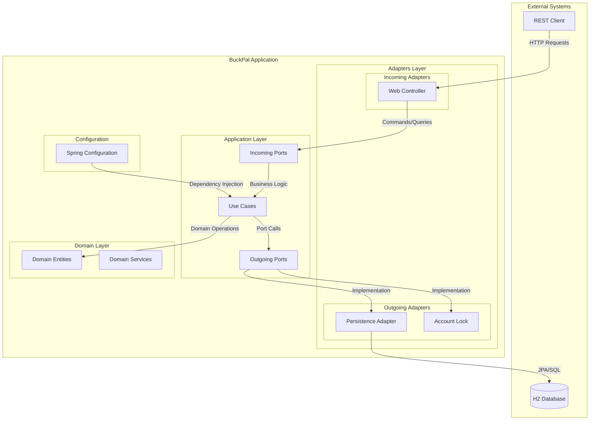
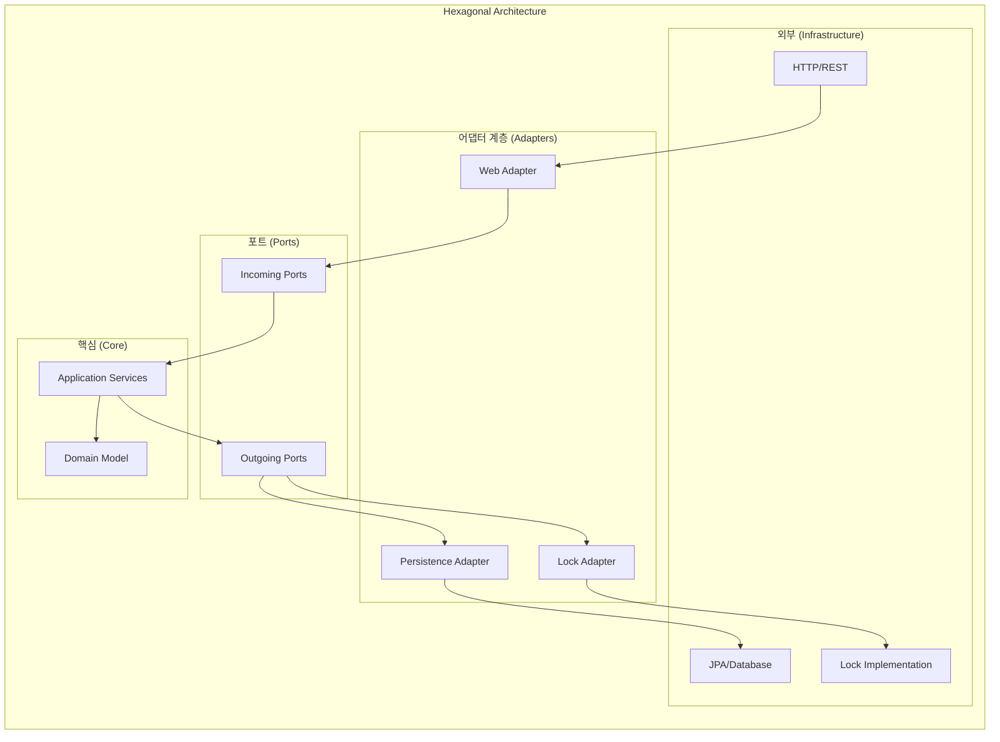
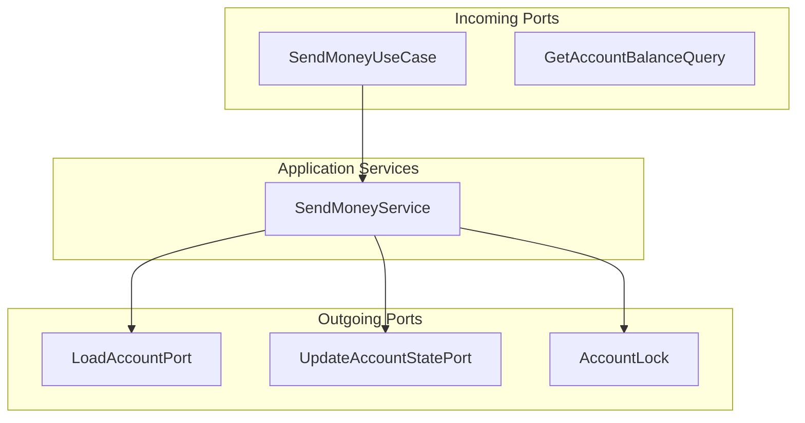
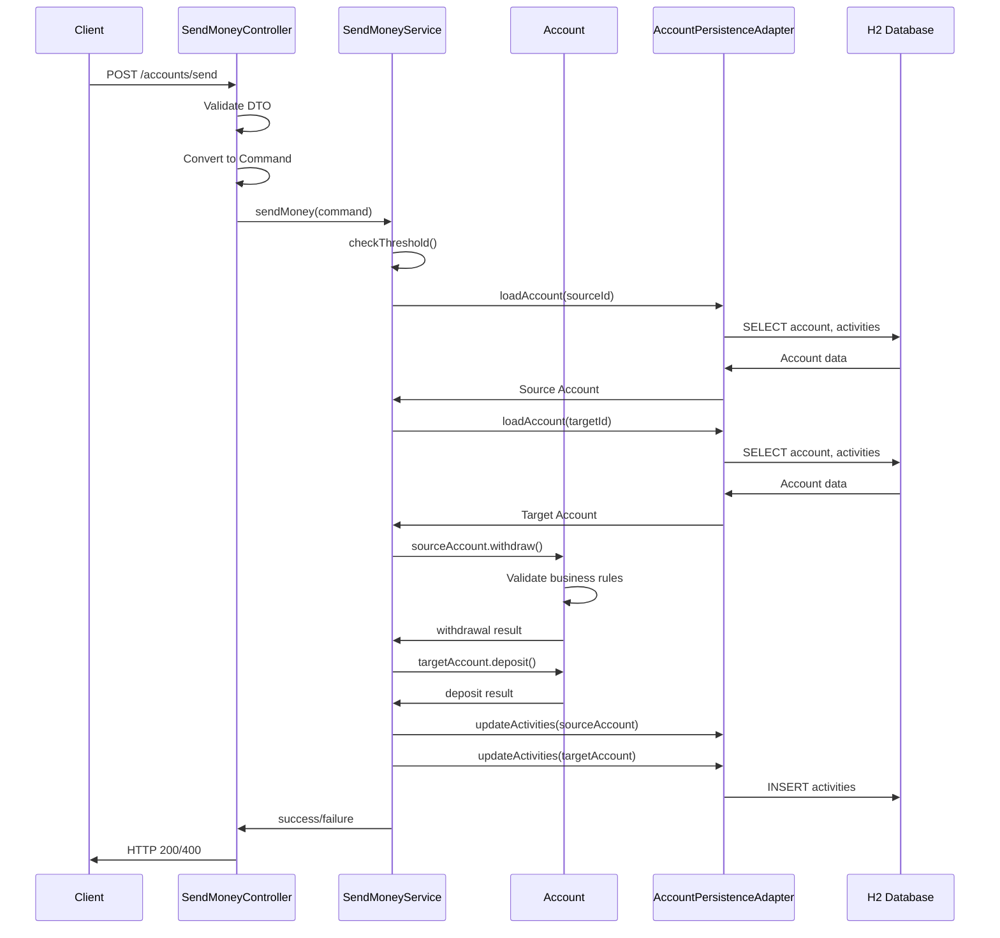
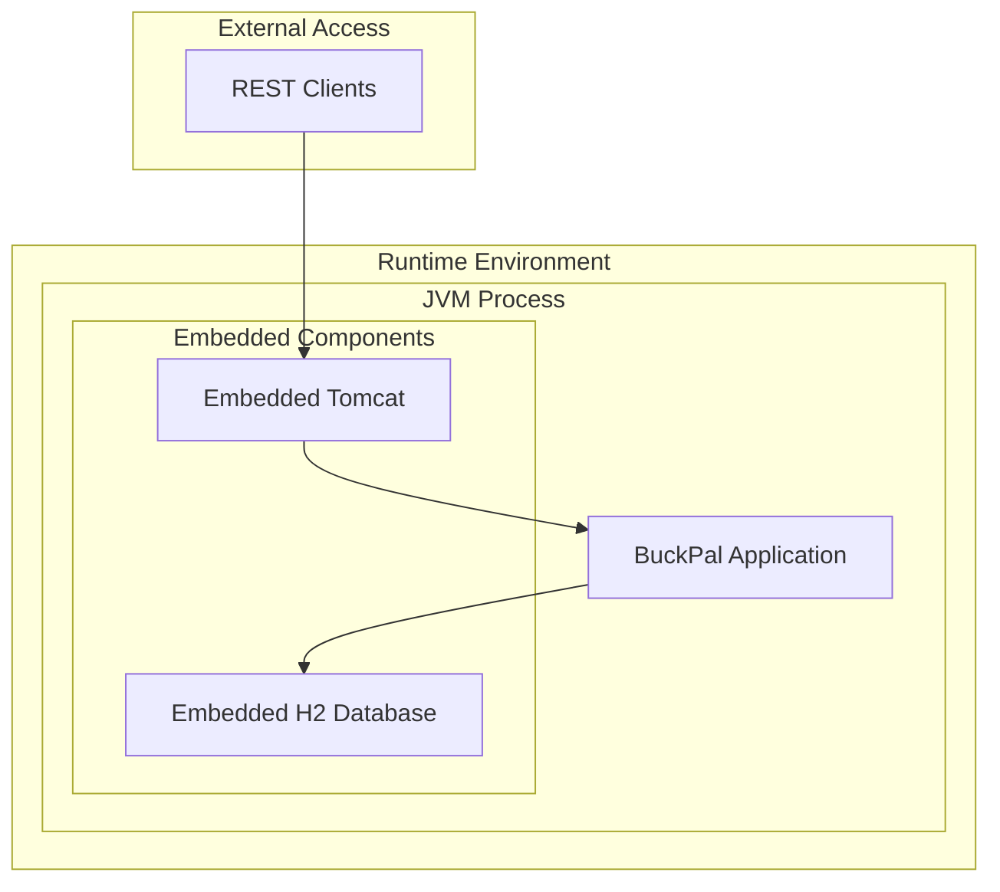
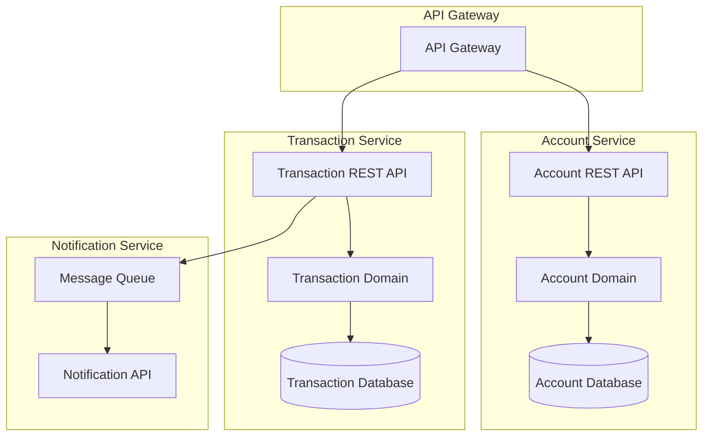

# 시스템 아키텍처 개요

## 전체 시스템 아키텍처

BuckPal은 **헥사고날 아키텍처**(Ports & Adapters)를 기반으로 한 모놀리식 Spring Boot 애플리케이션입니다.

### 시스템 아키텍처 다이어그램



### 헥사고날 아키텍처 구조



## 주요 컴포넌트와 관계

### 1. 도메인 계층 (Core)
**위치**: `src/main/java/dev/haja/buckpal/account/domain/`

```kotlin
// 핵심 도메인 모델
Account ◄─── ActivityWindow
   │              │
   ▼              ▼
Money         Activity
   │
   ▼
AccountId
```

**주요 컴포넌트**:
- **Account**: 집합체 루트, 송금 비즈니스 규칙 캡슐화
- **Money**: 금액 값 객체, BigInteger 기반 정확한 계산
- **Activity**: 거래 활동 이벤트, 감사 로그 역할
- **ActivityWindow**: 시간 윈도우 기반 활동 관리

### 2. 애플리케이션 계층 (Application)
**위치**: `src/main/java/dev/haja/buckpal/account/application/`



### 3. 어댑터 계층 (Infrastructure)

#### 인커밍 어댑터
**위치**: `src/main/java/dev/haja/buckpal/account/adapter/in/web/`

```java
@RestController
class SendMoneyController {
    @PostMapping("/accounts/send")
    ResponseEntity<Void> sendMoney(@Valid @RequestBody SendMoneyReqDto dto)
}
```

#### 아웃고잉 어댑터
**위치**: `src/main/java/dev/haja/buckpal/account/adapter/out/persistence/`

```java
@PersistenceAdapter
class AccountPersistenceAdapter implements LoadAccountPort, UpdateAccountStatePort {
    // JPA 기반 영속성 구현
}
```

## 데이터 플로우와 통신 패턴

### 송금 처리 플로우



### 통신 패턴 특징

1. **Request-Response**: 동기식 HTTP 통신
2. **Command Pattern**: 명령 객체를 통한 요청 캡슐화
3. **Repository Pattern**: 데이터 접근 추상화
4. **Factory Pattern**: 도메인 객체 생성
5. **Strategy Pattern**: 다양한 구현체 교체 가능

## 배포 구조

### 현재 구조: 모놀리식 애플리케이션



### 배포 특징

1. **패키징**: Spring Boot 실행 가능한 JAR
2. **데이터베이스**: 인메모리 H2 (개발/테스트용)
3. **웹 서버**: 내장 Tomcat
4. **설정 관리**: Spring Profiles (local, prod)

### 실행 방법

```bash
# 개발 환경
./gradlew bootRun

# JAR 빌드 및 실행
./gradlew bootJar
java -jar build/libs/buckpal-*.jar

# 네이티브 이미지 컴파일 (GraalVM)
./gradlew nativeCompile
./build/native/nativeCompile/buckpal
```

## 확장 가능성 및 마이크로서비스 전환

### 현재 경계 (Bounded Context)
- **Account Context**: 계좌 관리 및 송금

### 마이크로서비스 분리 시나리오



### 분리 후 장점
1. **독립적 배포**: 각 서비스별 독립적 배포 가능
2. **기술 스택 다양화**: 서비스별 최적 기술 선택
3. **확장성**: 필요에 따른 서비스별 스케일링
4. **장애 격리**: 한 서비스 장애가 전체에 영향 최소화

이러한 아키텍처는 헥사고날 패턴의 장점을 활용하여 향후 마이크로서비스로의 전환을 용이하게 하며, 각 계층의 책임이 명확히 분리되어 있어 유지보수성과 테스트 용이성을 확보하고 있습니다.