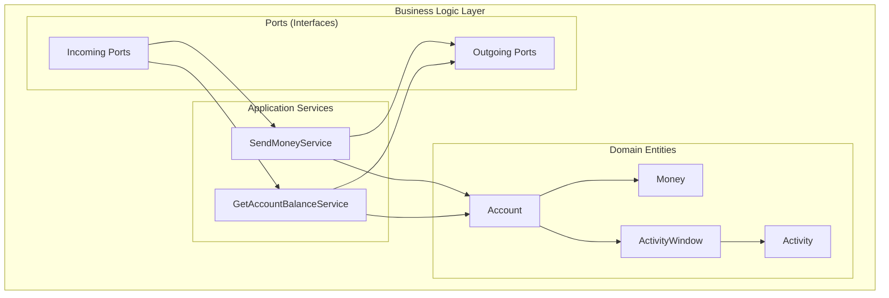
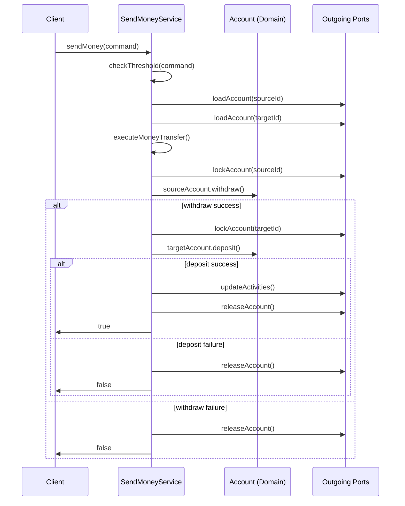

# 비즈니스 로직 컴포넌트 문서

## 비즈니스 로직 아키텍처 개요

BuckPal 프로젝트는 **헥사고날 아키텍처**를 따라 비즈니스 로직을 **도메인 계층**과 **애플리케이션 서비스 계층**으로 분리합니다.

### 아키텍처 구조


## 1. 애플리케이션 서비스 컴포넌트

### SendMoneyService (핵심 비즈니스 서비스)

**파일 위치**: `src/main/java/dev/haja/buckpal/account/application/service/SendMoneyService.java`

#### 클래스 정의
```java
@Component
@RequiredArgsConstructor
@Transactional
public class SendMoneyService implements SendMoneyUseCase {
    
    // 의존성 주입 필드들
    private final LoadAccountPort loadAccountPort;
    private final AccountLock accountLock;
    private final UpdateAccountStatePort updateAccountStatePort;
    private final MoneyTransferProperties moneyTransferProperties;
    private final BuckPalConfigurationProperties buckPalConfigurationProperties;
}
```

#### 핵심 메서드 및 책임

| 메서드명 | 책임 | 반환 타입 | 설명 |
|----------|------|-----------|------|
| `sendMoney(SendMoneyCommand)` | 송금 유스케이스 실행 | `boolean` | 메인 비즈니스 로직 조율 |
| `executeMoneyTransfer()` | 실제 송금 실행 | `boolean` | 출금→입금→상태업데이트 순서 보장 |
| `withdrawFromSourceAccount()` | 출금 처리 | `boolean` | 출금 계좌에서 돈 인출 |
| `depositToTargetAccount()` | 입금 처리 | `boolean` | 입금 계좌에 돈 예금 |
| `checkThreshold()` | 송금 한도 검증 | `void` | 비즈니스 규칙 검증 |
| `updateAccountStates()` | 계좌 상태 영속화 | `void` | 도메인 상태를 데이터베이스에 저장 |

#### 비즈니스 플로우


#### 예외 처리 전략
```java
// 비즈니스 규칙 위반
public class ThresholdExceededException extends RuntimeException {
    private final Money threshold;
    private final Money actual;
    
    public ThresholdExceededException(Money threshold, Money actual) {
        super(String.format("송금 한도(%s)를 초과했습니다: %s", threshold, actual));
        this.threshold = threshold;
        this.actual = actual;
    }
}

// 설정 오류
if (historyLookbackDays <= 0) {
    throw new IllegalArgumentException(
        "historyLookbackDays must be positive, but was: " + historyLookbackDays);
}
```

### GetAccountBalanceService (조회 서비스)

**파일 위치**: `src/main/java/dev/haja/buckpal/account/application/service/GetAccountBalanceService.java`

```java
@RequiredArgsConstructor
public class GetAccountBalanceService implements GetAccountBalanceQuery {

    private final LoadAccountPort loadAccountPort;

    @Override
    public Money getAccountBalance(AccountId accountId) {
        return loadAccountPort.loadAccount(accountId, LocalDateTime.now())
                .calculateBalance();
    }
}
```

#### 특징
- **단순성**: 단일 책임으로 계좌 잔액만 조회
- **실시간 계산**: 현재 시점 기준 동적 잔액 계산
- **도메인 위임**: Account 엔티티의 calculateBalance() 메서드 활용

## 2. 도메인 엔티티 컴포넌트

### Money (값 객체)

**파일 위치**: `src/main/java/dev/haja/buckpal/account/domain/Money.java`

```java
@Value
public class Money {
    public static Money ZERO = Money.of(0L);
    
    @NonNull 
    private final BigInteger amount;
    
    // 정적 팩토리 메서드
    public static Money of(long longValue) {
        return new Money(BigInteger.valueOf(longValue));
    }
    
    // 산술 연산 메서드
    public static Money add(Money a, Money b);
    public static Money subtract(Money a, Money b);
    public Money plus(Money money);
    public Money minus(Money money);
    public Money negate();
    
    // 비교 메서드
    public boolean isPositive();
    public boolean isPositiveOrZero();
    public boolean isNegative();
    public boolean isNegativeOrZero();
    public boolean isGreaterThan(Money money);
    public boolean isGreaterThanOrEqualTo(Money money);
}
```

#### 설계 특징
- **불변 객체**: 생성 후 상태 변경 불가
- **BigInteger 사용**: 정확한 금액 계산으로 소수점 오차 방지
- **풍부한 API**: 도메인 친화적인 메서드 제공
- **타입 안전성**: 원시 숫자 타입 대신 도메인 타입 사용

### Account (집합체 루트)

**파일 위치**: `src/main/java/dev/haja/buckpal/account/domain/Account.java`

#### 핵심 메서드
```java
public class Account {
    private final AccountId id;
    private final Money baselineBalance;
    private final ActivityWindow activityWindow;
    
    // 비즈니스 로직 메서드
    public Money calculateBalance() {
        return Money.add(
            this.baselineBalance,
            this.activityWindow.calculateBalance(this.id)
        );
    }
    
    public boolean withdraw(Money money, AccountId targetAccountId) {
        if (!mayWithdraw(money)) {
            return false;
        }
        
        Activity withdrawal = new Activity(
            this.id, this.id, targetAccountId,
            LocalDateTime.now(), money
        );
        
        this.activityWindow.addActivity(withdrawal);
        return true;
    }
    
    public boolean deposit(Money money, AccountId sourceAccountId) {
        Activity deposit = new Activity(
            this.id, sourceAccountId, this.id,
            LocalDateTime.now(), money
        );
        
        this.activityWindow.addActivity(deposit);
        return true;
    }
    
    private boolean mayWithdraw(Money money) {
        return Money.add(
            this.calculateBalance(),
            money.negate()
        ).isPositiveOrZero();
    }
}
```

#### 비즈니스 규칙
- **잔액 검증**: 출금 시 잔액 부족 방지
- **Activity 생성**: 모든 거래를 Activity로 기록
- **불변성**: 기존 Activity는 변경하지 않고 새로 추가만
- **자가 검증**: 도메인 규칙을 엔티티 내부에서 검증

### ActivityWindow (도메인 서비스)

**파일 위치**: `src/main/java/dev/haja/buckpal/account/domain/ActivityWindow.java`

```java
public class ActivityWindow {
    private List<Activity> activities;
    
    public Money calculateBalance(Account.AccountId accountId) {
        Money depositBalance = activities.stream()
            .filter(a -> a.getTargetAccountId().equals(accountId))
            .map(Activity::getMoney)
            .reduce(Money.ZERO, Money::add);
            
        Money withdrawalBalance = activities.stream()
            .filter(a -> a.getSourceAccountId().equals(accountId))
            .map(Activity::getMoney)
            .reduce(Money.ZERO, Money::add);
            
        return Money.subtract(depositBalance, withdrawalBalance);
    }
    
    public void addActivity(Activity activity) {
        this.activities.add(activity);
    }
    
    public List<Activity> getActivitiesAfter(LocalDateTime date) {
        return activities.stream()
            .filter(activity -> activity.getTimestamp().isAfter(date))
            .collect(Collectors.toList());
    }
}
```

## 3. 포트 인터페이스 (의존성 역전)

### 인커밍 포트 (Incoming Ports)

#### SendMoneyUseCase
**파일 위치**: `src/main/java/dev/haja/buckpal/account/application/port/in/SendMoneyUseCase.java`

```java
public interface SendMoneyUseCase {
    boolean sendMoney(SendMoneyCommand command);
}
```

#### GetAccountBalanceQuery
**파일 위치**: `src/main/java/dev/haja/buckpal/account/application/port/in/GetAccountBalanceQuery.java`

```java
public interface GetAccountBalanceQuery {
    Money getAccountBalance(AccountId accountId);
}
```

### 아웃고잉 포트 (Outgoing Ports)

#### LoadAccountPort
**파일 위치**: `src/main/java/dev/haja/buckpal/account/application/port/out/LoadAccountPort.java`

```java
public interface LoadAccountPort {
    Account loadAccount(AccountId accountId, LocalDateTime baselineDate);
}
```

#### UpdateAccountStatePort
**파일 위치**: `src/main/java/dev/haja/buckpal/account/application/port/out/UpdateAccountStatePort.java`

```java
public interface UpdateAccountStatePort {
    void updateActivities(Account account);
}
```

#### AccountLock
**파일 위치**: `src/main/java/dev/haja/buckpal/account/application/port/out/AccountLock.java`

```java
public interface AccountLock {
    void lockAccount(AccountId accountId);
    void releaseAccount(AccountId accountId);
}
```

## 4. 명령 객체 (Command Objects)

### SendMoneyCommand

**파일 위치**: `src/main/java/dev/haja/buckpal/account/application/port/in/SendMoneyCommand.java`

```java
@EqualsAndHashCode(callSuper = false)
public class SendMoneyCommand extends SelfValidating<SendMoneyCommand> {

    @NotNull
    private final AccountId sourceAccountId;

    @NotNull  
    private final AccountId targetAccountId;

    @NotNull
    private final Money money;

    public SendMoneyCommand(AccountId sourceAccountId, AccountId targetAccountId, Money money) {
        this.sourceAccountId = sourceAccountId;
        this.targetAccountId = targetAccountId;
        this.money = money;
        this.validateSelf();  // 생성 시 자동 검증
    }
}
```

#### 특징
- **자가 검증**: `SelfValidating` 추상 클래스 상속
- **불변 객체**: final 필드와 생성자만 제공
- **Bean Validation**: Jakarta 검증 어노테이션 활용

## 5. 설정 및 프로퍼티 컴포넌트

### MoneyTransferProperties

**파일 위치**: `src/main/java/dev/haja/buckpal/account/application/service/MoneyTransferProperties.java`

```java
@Data
@Component
@ConfigurationProperties(prefix = "buckpal.transfer")
public class MoneyTransferProperties {
    private Money maximumTransferThreshold = Money.of(1_000_000L); // 기본값: 100만원
}
```

### BuckPalConfigurationProperties

**파일 위치**: `src/main/java/dev/haja/buckpal/BuckPalConfigurationProperties.java`

```java
@Data
@Component
@ConfigurationProperties(prefix = "buckpal")
public class BuckPalConfigurationProperties {
    
    private Account account = new Account();
    
    @Data
    public static class Account {
        private int historyLookbackDays = 10; // 기본값: 10일
    }
}
```

#### YAML 설정
```yaml
# application.yml
buckpal:
  account:
    history-lookback-days: 10
  transfer:
    maximum-transfer-threshold: 1000000
```

## 6. 공통 유틸리티

### SelfValidating (자가 검증 추상 클래스)

**파일 위치**: `src/main/java/dev/haja/buckpal/common/SelfValidating.java`

```java
public abstract class SelfValidating<T> {
    private final Validator validator;

    public SelfValidating() {
        try (ValidatorFactory validatorFactory = Validation.buildDefaultValidatorFactory()) {
            validator = validatorFactory.getValidator();
        }
    }

    @SuppressWarnings("unchecked")
    protected void validateSelf() {
        Set<ConstraintViolation<T>> violations = validator.validate((T) this);
        if (!violations.isEmpty()) {
            throw new ConstraintViolationException(violations);
        }
    }
}
```

#### 사용 패턴
```java
// 명령 객체에서 활용
public class SendMoneyCommand extends SelfValidating<SendMoneyCommand> {
    @NotNull
    private final AccountId sourceAccountId;
    
    public SendMoneyCommand(AccountId sourceAccountId, ...) {
        this.sourceAccountId = sourceAccountId;
        this.validateSelf(); // 생성 시 자동 검증
    }
}
```

## 7. 의존성 주입 패턴

### Spring 의존성 주입 전략

#### Constructor Injection (권장)
```java
@Component
@RequiredArgsConstructor // Lombok이 final 필드 생성자 자동 생성
public class SendMoneyService implements SendMoneyUseCase {
    
    private final LoadAccountPort loadAccountPort;
    private final AccountLock accountLock;
    private final UpdateAccountStatePort updateAccountStatePort;
    
    // 생성자는 Lombok이 자동 생성
}
```

#### Interface Segregation (인터페이스 분리)
```java
// 단일 책임 원칙에 따른 포트 분리
public interface LoadAccountPort { /* ... */ }
public interface UpdateAccountStatePort { /* ... */ }
public interface AccountLock { /* ... */ }

// 하나의 어댑터가 여러 포트를 구현할 수 있음
@PersistenceAdapter
public class AccountPersistenceAdapter 
    implements LoadAccountPort, UpdateAccountStatePort {
    // 구현
}
```

## 8. 테스트 지원 컴포넌트

### 테스트 데이터 팩토리

#### AccountTestData
**파일 위치**: `src/test/java/dev/haja/buckpal/common/AccountTestData.java`

```java
public class AccountTestData {
    public static AccountBuilder defaultAccount() {
        return new AccountBuilder()
                .withAccountId(new AccountId(42L))
                .withBaselineBalance(Money.of(999L))
                .withActivityWindow(new ActivityWindow(
                    ActivityTestData.defaultActivity().build()));
    }
}
```

#### ActivityTestData
**파일 위치**: `src/test/java/dev/haja/buckpal/common/ActivityTestData.java`

```java
public class ActivityTestData {
    public static ActivityBuilder defaultActivity() {
        return new ActivityBuilder()
                .withId(new ActivityId(42L))
                .withOwnerAccountId(new AccountId(42L))
                .withSourceAccountId(new AccountId(42L))
                .withTargetAccountId(new AccountId(41L))
                .withTimestamp(LocalDateTime.now())
                .withMoney(Money.of(999L));
    }
}
```

## 9. 테스트 파일 매핑

| 비즈니스 컴포넌트 | 테스트 파일 위치 | 테스트 유형 |
|------------------|------------------|------------|
| `SendMoneyService` | `src/test/java/dev/haja/buckpal/account/application/service/SendMoneyServiceTest.java` | 단위 테스트 |
| `Account` (도메인) | `src/test/java/dev/haja/buckpal/account/domain/AccountTest.java` | 도메인 테스트 |
| `ActivityWindow` | `src/test/java/dev/haja/buckpal/account/domain/ActivityWindowTest.java` | 도메인 테스트 |
| `SendMoneyController` | `src/test/java/dev/haja/buckpal/account/adapter/in/web/SendMoneyControllerTest.java` | 웹 계층 테스트 |
| `AccountPersistenceAdapter` | `src/test/java/dev/haja/buckpal/account/adapter/out/persistence/AccountPersistenceAdapterTest.java` | 통합 테스트 |

## 10. 비즈니스 규칙 요약

### 송금 비즈니스 규칙
1. **송금 한도 검증**: 설정된 최대 금액을 초과할 수 없음
2. **잔액 검증**: 출금 시 계좌 잔액이 충분해야 함
3. **계좌 잠금**: 동시성 제어를 위한 계좌 레벨 락
4. **원자성**: 출금과 입금이 모두 성공하거나 모두 실패
5. **Activity 기록**: 모든 거래는 Activity로 영구 기록
6. **이중 기록**: 하나의 송금은 두 개의 Activity (출금용, 입금용)

### 도메인 불변량 (Domain Invariants)
1. **Money 양수 규칙**: 거래 금액은 항상 양수
2. **Account ID 필수**: 모든 계좌는 유효한 식별자 보유
3. **Activity 불변성**: 생성된 Activity는 변경 불가
4. **잔액 일관성**: 잔액은 Activity 기록과 일치

이 비즈니스 로직 구조는 **헥사고날 아키텍처**의 핵심 원칙인 **도메인 중심성**과 **의존성 역전**을 완벽하게 구현하여, 변화에 유연하고 테스트 가능한 비즈니스 로직을 제공합니다.