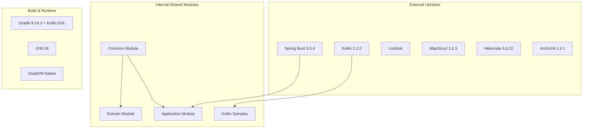
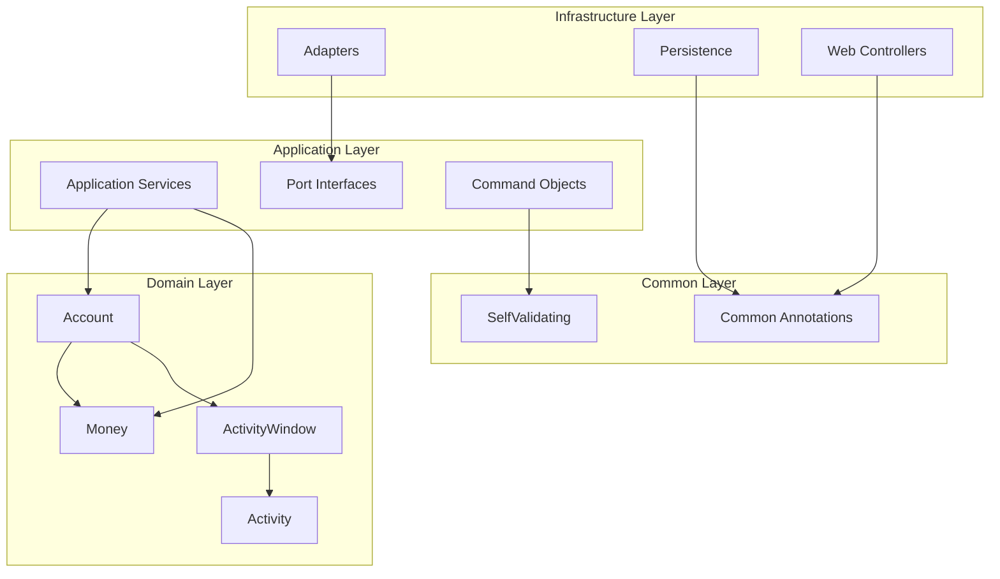
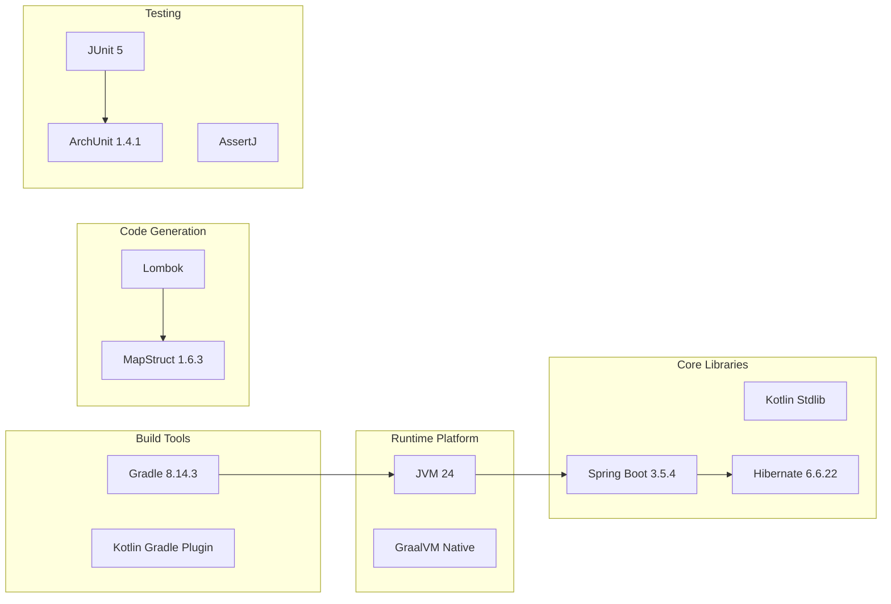

# 공유 모듈 및 라이브러리 문서

## 공유 모듈 개요

BuckPal 프로젝트는 **헥사고날 아키텍처**에 따라 계층별로 공유 가능한 모듈과 라이브러리를 구성합니다.

### 모듈 구조


## 1. 내부 공유 모듈

### Common Module (공통 기반 모듈)

**패키지**: `dev.haja.buckpal.common`

#### Export 목록

| 컴포넌트 | 파일 위치 | 타입 | 용도 |
|----------|-----------|------|------|
| `@WebAdapter` | `WebAdapter.java:14` | Annotation | 웹 계층 아키텍처 표시 |
| `@PersistenceAdapter` | `PersistenceAdapter.java:12` | Annotation | 영속성 계층 아키텍처 표시 |
| `SelfValidating<T>` | `SelfValidating.java:7` | Abstract Class | 자가 검증 기능 제공 |

#### WebAdapter (전역 예외 처리 + 아키텍처 어노테이션)
```java
// 아키텍처 표시용 어노테이션
@Target({ElementType.TYPE})
@Retention(RetentionPolicy.RUNTIME)
@Documented
@Component
public @interface WebAdapter {
    @AliasFor(annotation = Component.class)
    String value() default "";
}

// 전역 예외 처리기
@RestControllerAdvice
public class WebAdapter {
    @ExceptionHandler(MethodArgumentNotValidException.class)
    @ResponseStatus(HttpStatus.BAD_REQUEST)
    public ResponseEntity<Map<String, String>> handleValidationExceptions(
            MethodArgumentNotValidException ex) {
        // 검증 오류를 구조화된 JSON으로 변환
    }
}
```

#### PersistenceAdapter
```java
@Target({ElementType.TYPE})
@Retention(RetentionPolicy.RUNTIME)
@Documented
@Component
public @interface PersistenceAdapter {
    @AliasFor(annotation = Component.class)
    String value() default "";
}
```

**용도**: 
- 헥사고날 아키텍처의 계층 표시
- ArchUnit 테스트에서 아키텍처 규칙 검증
- Spring의 `@Component` 역할 수행

#### SelfValidating (자가 검증 추상 클래스)
```java
public abstract class SelfValidating<T> {
    private final Validator validator;

    public SelfValidating() {
        try (ValidatorFactory validatorFactory = Validation.buildDefaultValidatorFactory()) {
            validator = validatorFactory.getValidator();
        }
    }

    @SuppressWarnings("unchecked")
    protected void validateSelf() {
        Set<ConstraintViolation<T>> violations = validator.validate((T) this);
        if (!violations.isEmpty()) {
            throw new ConstraintViolationException(violations);
        }
    }
}
```

**특징**:
- **제네릭 설계**: 모든 타입에 재사용 가능
- **Jakarta Validation 통합**: Bean Validation 활용
- **즉시 검증**: 객체 생성 시 자동 검증
- **예외 기반**: 검증 실패 시 `ConstraintViolationException` 발생

### Domain Module (도메인 공유 컴포넌트)

**패키지**: `dev.haja.buckpal.account.domain`

#### Export 목록

| 컴포넌트 | 파일 위치 | 타입 | 설명 |
|----------|-----------|------|------|
| `Money` | `Money.java:9` | Value Object | 금액 값 객체 |
| `Account` | `Account.java` | Aggregate Root | 계좌 집합체 |
| `Activity` | `Activity.java` | Entity | 거래 활동 엔티티 |
| `ActivityWindow` | `ActivityWindow.java` | Domain Service | 활동 윈도우 서비스 |

#### Money (핵심 값 객체)
```java
@Value
public class Money {
    public static Money ZERO = Money.of(0L);
    
    @NonNull 
    private final BigInteger amount;
    
    // 정적 팩토리 메서드
    public static Money of(long longValue) {
        return new Money(BigInteger.valueOf(longValue));
    }
    
    // 산술 연산 (정적)
    public static Money add(Money a, Money b);
    public static Money subtract(Money a, Money b);
    
    // 산술 연산 (인스턴스)
    public Money plus(Money money);
    public Money minus(Money money);
    public Money negate();
    
    // 비교 연산
    public boolean isPositive();
    public boolean isPositiveOrZero();
    public boolean isGreaterThan(Money money);
    public boolean isGreaterThanOrEqualTo(Money money);
}
```

**재사용성**:
- 모든 금액 관련 계산에 사용
- BigInteger로 정확한 계산 보장
- 불변 객체로 스레드 안전성 보장
- 도메인 친화적 API 제공

#### Account.AccountId (식별자 값 객체)
```java
public record AccountId(Long value) {
    public AccountId {
        if (value == null || value <= 0) {
            throw new IllegalArgumentException("AccountId must be positive");
        }
    }
}
```

#### Activity.ActivityId (식별자 값 객체)
```java
public record ActivityId(Long value) {
    public ActivityId {
        if (value != null && value <= 0) {
            throw new IllegalArgumentException("ActivityId must be positive when not null");
        }
    }
}
```

### Test Module (테스트 공유 컴포넌트)

**패키지**: `dev.haja.buckpal.common` (테스트)

#### Export 목록

| 컴포넌트 | 파일 위치 | 타입 | 용도 |
|----------|-----------|------|------|
| `AccountTestData` | `src/test/.../AccountTestData.java` | Test Factory | Account 테스트 데이터 생성 |
| `ActivityTestData` | `src/test/.../ActivityTestData.java` | Test Factory | Activity 테스트 데이터 생성 |

#### AccountTestData (빌더 패턴)
```java
public class AccountTestData {
    
    public static AccountBuilder defaultAccount() {
        return new AccountBuilder()
                .withAccountId(new AccountId(42L))
                .withBaselineBalance(Money.of(999L))
                .withActivityWindow(new ActivityWindow(
                    ActivityTestData.defaultActivity().build()));
    }
    
    public static AccountBuilder emptyAccount() {
        return new AccountBuilder()
                .withAccountId(new AccountId(42L))
                .withBaselineBalance(Money.ZERO)
                .withActivityWindow(new ActivityWindow(Collections.emptyList()));
    }
    
    public static class AccountBuilder {
        private AccountId accountId = new AccountId(42L);
        private Money baselineBalance = Money.ZERO;
        private ActivityWindow activityWindow = new ActivityWindow(Collections.emptyList());
        
        public AccountBuilder withAccountId(AccountId accountId) {
            this.accountId = accountId;
            return this;
        }
        
        public AccountBuilder withBaselineBalance(Money baselineBalance) {
            this.baselineBalance = baselineBalance;
            return this;
        }
        
        public AccountBuilder withActivityWindow(ActivityWindow activityWindow) {
            this.activityWindow = activityWindow;
            return this;
        }
        
        public Account build() {
            return Account.withId(this.accountId, this.baselineBalance, this.activityWindow);
        }
    }
}
```

#### ActivityTestData (빌더 패턴)
```java
public class ActivityTestData {
    
    public static ActivityBuilder defaultActivity() {
        return new ActivityBuilder()
                .withId(new ActivityId(42L))
                .withOwnerAccountId(new AccountId(42L))
                .withSourceAccountId(new AccountId(42L))
                .withTargetAccountId(new AccountId(41L))
                .withTimestamp(LocalDateTime.now())
                .withMoney(Money.of(999L));
    }
    
    public static ActivityBuilder withdrawalActivity() {
        return defaultActivity()
                .withMoney(Money.of(999L));
    }
    
    public static ActivityBuilder depositActivity() {
        return defaultActivity()
                .withSourceAccountId(new AccountId(41L))
                .withTargetAccountId(new AccountId(42L));
    }
}
```

### Kotlin Migration Module

**패키지**: `dev.haja.java2kotlin`, `dev.haja.buckpal.sample`

#### Export 목록

| 컴포넌트 | 파일 위치 | 타입 | 설명 |
|----------|-----------|------|------|
| `Leg` | `Leg.kt:6` | Data Class | 여행 구간 데이터 클래스 |
| `List<Leg>.longestLegOver()` | `Legs.kt:5` | Extension Function | 리스트 확장 함수 |
| `HelloWorld.main()` | `HelloWorld.kt:3` | Function | Kotlin 샘플 |

#### Leg (Kotlin 데이터 클래스)
```kotlin
data class Leg(
    val description: String,
    val plannedStart: ZonedDateTime,
    val plannedEnd: ZonedDateTime
) {
    val plannedDuration: Duration 
        get() = Duration.between(plannedStart, plannedEnd)
}
```

#### Extension Functions (Kotlin 확장 함수)
```kotlin
fun List<Leg>.longestLegOver(duration: Duration): Leg? {
    val longestLeg = maxByOrNull(Leg::plannedDuration)
    return when {
        longestLeg == null -> null
        longestLeg.plannedDuration > duration -> longestLeg
        else -> null
    }
}
```

**특징**:
- **함수형 스타일**: Kotlin의 함수형 프로그래밍 활용
- **Null 안전성**: `?` 연산자로 null 안전성 보장
- **Extension Functions**: 기존 타입에 새 기능 추가

## 2. 외부 라이브러리 의존성

### Core Framework Dependencies

#### Spring Boot 3.5.4 Stack
```kotlin
// build.gradle.kts
implementation("org.springframework.boot:spring-boot-starter-web")
implementation("org.springframework.boot:spring-boot-starter-data-jpa") 
implementation("org.springframework.boot:spring-boot-starter-validation")
implementation("org.springframework.boot:spring-boot-starter-actuator")
```

**제공 기능**:
- **Web**: REST API, JSON 시리얼라이제이션, 내장 Tomcat
- **Data JPA**: Hibernate ORM, 리포지토리 추상화
- **Validation**: Jakarta Bean Validation 2.0
- **Actuator**: 헬스 체크, 메트릭, 모니터링

#### Kotlin Integration
```kotlin
implementation("org.jetbrains.kotlin:kotlin-reflect")
implementation("com.github.consoleau:kassava:2.1.0")
```

**제공 기능**:
- **Reflection**: Spring의 런타임 리플렉션 지원  
- **Kassava**: equals/hashCode/toString 생성

### Development Tools

#### MapStruct (객체 매핑)
```kotlin
implementation("org.mapstruct:mapstruct:1.6.3")
annotationProcessor("org.mapstruct:mapstruct-processor:1.6.3")
annotationProcessor("org.projectlombok:lombok-mapstruct-binding:0.2.0")
```

**제공 기능**:
- 컴파일 타임 코드 생성
- JPA Entity ↔ Domain Model 매핑
- Lombok과 통합된 매핑

#### Lombok (보일러플레이트 제거)
```kotlin
compileOnly("org.projectlombok:lombok")
annotationProcessor("org.projectlombok:lombok")
```

**주요 어노테이션**:
- `@Value`: 불변 클래스 (Money, Activity)
- `@Data`: 가변 클래스 (JPA Entity)
- `@RequiredArgsConstructor`: 생성자 주입
- `@NonNull`: Null 체크

### Testing Framework

#### JUnit 5 + ArchUnit
```kotlin
testImplementation("org.springframework.boot:spring-boot-starter-test")
testImplementation("com.tngtech.archunit:archunit-junit5-engine:1.4.1")
```

**제공 기능**:
- **JUnit 5**: 모던 테스트 프레임워크
- **ArchUnit**: 아키텍처 규칙 자동 검증
- **AssertJ**: 유창한 어설션 API
- **Mockito**: 모킹 프레임워크

### Database

#### H2 Database
```kotlin
runtimeOnly("com.h2database:h2")
testImplementation("com.h2database:h2")
```

**특징**:
- 인메모리 데이터베이스
- 개발/테스트 환경 최적화
- SQL 호환성

## 3. 모듈 간 의존성 그래프

### Internal Dependencies


### External Dependencies


## 4. 공통 타입 및 인터페이스

### Domain Value Objects
```java
// 공통 식별자 패턴
public record AccountId(Long value) {}
public record ActivityId(Long value) {}

// 공통 값 객체 패턴
@Value
public class Money {
    @NonNull BigInteger amount;
    // 공통 메서드들...
}
```

### Port Interface Pattern
```java
// 인커밍 포트 패턴
public interface SendMoneyUseCase {
    boolean sendMoney(SendMoneyCommand command);
}

// 아웃고잉 포트 패턴
public interface LoadAccountPort {
    Account loadAccount(AccountId accountId, LocalDateTime baselineDate);
}
```

### Architecture Annotations
```java
// 계층별 아키텍처 표시
@WebAdapter        // Web 어댑터 표시
@PersistenceAdapter // 영속성 어댑터 표시
@UseCase           // 유스케이스 표시 (향후)
@DomainService     // 도메인 서비스 표시 (향후)
```

## 5. 버전 관리 및 호환성

### Java/Kotlin 호환성
```kotlin
java {
    toolchain { languageVersion = JavaLanguageVersion.of(24) }
    sourceCompatibility = JavaVersion.VERSION_24
}

kotlin {
    compilerOptions {
        jvmTarget.set(JvmTarget.JVM_24)
        languageVersion.set(KotlinVersion.KOTLIN_2_2)
        apiVersion.set(KotlinVersion.KOTLIN_2_2)
        freeCompilerArgs.addAll("-Xjsr305=strict")
    }
}
```

### Library Version Matrix
| 라이브러리 | 버전 | 호환성 | 특징 |
|-----------|------|--------|------|
| Spring Boot | 3.5.4 | JVM 21+ | 최신 안정 버전 |
| Kotlin | 2.2.0 | JVM 24 | 최신 K2 컴파일러 |
| Hibernate | 6.6.22 | JDK 24 | ORM 엔진 |
| MapStruct | 1.6.3 | JDK 24 | 코드 생성 |
| ArchUnit | 1.4.1 | JUnit 5 | 아키텍처 테스트 |

## 6. 모듈 재사용 패턴

### Command Pattern
```java
// 모든 유스케이스에서 재사용 가능한 명령 패턴
public abstract class Command extends SelfValidating<Command> {
    // 공통 검증 로직
}

public class SendMoneyCommand extends Command {
    // 구체적 명령 구현
}
```

### Builder Pattern (Test Data)
```java
// 모든 테스트에서 재사용 가능한 빌더 패턴
public interface TestDataBuilder<T> {
    T build();
}

public class AccountTestData implements TestDataBuilder<Account> {
    // 체이닝 가능한 빌더 구현
}
```

### Port Pattern (Hexagonal Architecture)
```java
// 모든 계층에서 재사용 가능한 포트 패턴
public interface IncomingPort<C, R> {
    R execute(C command);
}

public interface OutgoingPort<I, O> {
    O load(I identifier);
}
```

이 공유 모듈 구조는 **코드 재사용성**과 **아키텍처 일관성**을 보장하면서, **Java와 Kotlin의 점진적 마이그레이션**을 지원하는 유연한 구조를 제공합니다.