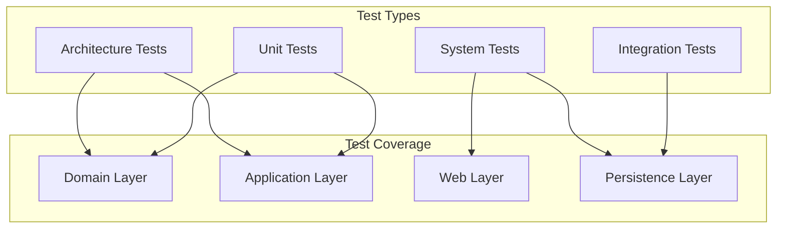

# 컴포넌트별 테스트 파일 매핑 문서

## 테스트 매핑 개요

BuckPal 프로젝트는 **헥사고날 아키텍처**에 따라 **계층별 테스트 전략**을 구현합니다. 각 컴포넌트는 해당 계층에 적합한 테스트 유형과 패턴을 적용합니다.

### 테스트 계층 구조


## 1. 도메인 계층 테스트 (Domain Layer)

### Account (집합체 루트)

#### 📁 소스 & 테스트 위치
- **소스 파일**: `src/main/java/dev/haja/buckpal/account/domain/Account.java`
- **테스트 파일**: `src/test/java/dev/haja/buckpal/account/domain/AccountTest.java`

#### 🧪 테스트 상세
```java
@DisplayName("Account 도메인 객체")
class AccountTest {
    
    @Test
    @DisplayName("withdrawalSucceeds: 성공적인 출금")
    void withdrawalSucceeds() {
        // Test Data Builder 패턴 사용
        AccountTestData.defaultAccount()
            .withAccountId(new AccountId(1L))
            .withBaselineBalance(Money.of(555L))
            .withActivityWindow(new ActivityWindow(
                ActivityTestData.defaultActivity()
                    .withTargetAccountId(new AccountId(99L))
                    .withMoney(Money.of(999L)).build(),
                ActivityTestData.defaultActivity()
                    .withTargetAccountId(new AccountId(1L))
                    .withMoney(Money.of(1000L)).build()))
            .build();
    }
}
```

**테스트 범위**:
- ✅ 계좌 잔액 계산 (`calculatesBalance`)
- ✅ 출금 성공 시나리오 (`withdrawalSucceeds`)
- ✅ 출금 실패 시나리오 (`withdrawalFailure`)
- ✅ 입금 성공 시나리오 (`depositSuccess`)

**테스트 패턴**:
- **Data Builder**: `AccountTestData`, `ActivityTestData` 활용
- **AssertJ**: 유창한 어설션 API 사용
- **상태 기반 검증**: 객체 상태 변화 확인

### ActivityWindow (도메인 서비스)

#### 📁 소스 & 테스트 위치
- **소스 파일**: `src/main/java/dev/haja/buckpal/account/domain/ActivityWindow.java`
- **테스트 파일**: `src/test/java/dev/haja/buckpal/account/domain/ActivityWindowTest.java`

#### 🧪 테스트 상세
```java
@Test
@DisplayName("calculatesBalance: 잔액을 정확히 계산함")
void calculatesBalance() {
    AccountId accountId = new AccountId(42L);
    Account account = AccountTestData.defaultAccount()
            .withAccountId(accountId)
            .withBaselineBalance(Money.of(0L))
            .withActivityWindow(new ActivityWindow(
                    ActivityTestData.defaultActivity()
                            .withSourceAccountId(new AccountId(42L))
                            .withTargetAccountId(new AccountId(41L))
                            .withMoney(Money.of(999L)).build(),
                    ActivityTestData.defaultActivity()
                            .withSourceAccountId(new AccountId(41L))
                            .withTargetAccountId(new AccountId(42L))
                            .withMoney(Money.of(1L)).build())).build();

    Money balance = account.calculateBalance();

    assertThat(balance).isEqualTo(Money.of(-998L));
}
```

**테스트 범위**:
- ✅ 계좌별 잔액 계산 (`calculatesBalance`)  
- ✅ 활동 윈도우 시작 타임스탬프 (`calculatesStartTimestamp`)
- ✅ 활동 윈도우 종료 타임스탬프 (`calculatesEndTimestamp`)

### 테스트 누락 컴포넌트 (Domain Layer)

#### Money (값 객체)
- **소스 파일**: `src/main/java/dev/haja/buckpal/account/domain/Money.java`  
- **테스트 파일**: ❌ **없음**
- **권장 테스트**: 산술 연산, 비교 연산, 불변성 검증

#### Activity (도메인 엔티티)
- **소스 파일**: `src/main/java/dev/haja/buckpal/account/domain/Activity.java`
- **테스트 파일**: ❌ **없음** 
- **권장 테스트**: 생성자 검증, 불변성 검증

## 2. 애플리케이션 계층 테스트 (Application Layer)

### SendMoneyService (유스케이스 서비스)

#### 📁 소스 & 테스트 위치
- **소스 파일**: `src/main/java/dev/haja/buckpal/account/application/service/SendMoneyService.java`
- **테스트 파일**: `src/test/java/dev/haja/buckpal/account/application/service/SendMoneyServiceTest.java`

#### 🧪 테스트 상세
```java
@ExtendWith(MockitoExtension.class)
class SendMoneyServiceTest {
    
    @Mock
    private LoadAccountPort loadAccountPort;
    
    @Mock
    private AccountLock accountLock;
    
    @Mock
    private UpdateAccountStatePort updateAccountStatePort;
    
    @Test
    @DisplayName("transactionSucceeds: 송금이 성공적으로 실행됨")
    void transactionSucceeds() {
        Account sourceAccount = givenSourceAccount();
        Account targetAccount = givenTargetAccount();
        
        given(loadAccountPort.loadAccount(eq(sourceAccountId), any(LocalDateTime.class)))
                .willReturn(sourceAccount);
        given(loadAccountPort.loadAccount(eq(targetAccountId), any(LocalDateTime.class)))
                .willReturn(targetAccount);
        
        Money money = Money.of(500L);
        SendMoneyCommand command = new SendMoneyCommand(sourceAccountId, targetAccountId, money);
        boolean success = sendMoneyService.sendMoney(command);
        
        assertThat(success).isTrue();
        
        then(accountLock).should().lockAccount(eq(sourceAccountId));
        then(sourceAccount).should().withdraw(eq(money), eq(targetAccountId));
        then(accountLock).should().releaseAccount(eq(sourceAccountId));
        then(accountLock).should().lockAccount(eq(targetAccountId));
        then(targetAccount).should().deposit(eq(money), eq(sourceAccountId));
        then(updateAccountStatePort).should().updateActivities(eq(sourceAccount));
        then(updateAccountStatePort).should().updateActivities(eq(targetAccount));
        then(accountLock).should().releaseAccount(eq(targetAccountId));
    }
}
```

**테스트 범위**:
- ✅ 송금 성공 플로우 (`transactionSucceeds`)
- ✅ 출금 실패 시 락 해제 (`givenWithdrawalFails_thenOnlySourceAccountIsLockedAndReleased`)
- ✅ 설정 검증 (`givenInvalidHistoryLookbackDays_thenThrowsIllegalArgumentException`)
- ✅ 커스텀 설정 적용 (`givenCustomHistoryLookbackDays_thenTransactionSucceeds`)

**테스트 패턴**:
- **BDD Mockito**: `given().willReturn()`, `then().should()` 스타일
- **ArgumentCaptor**: 복잡한 객체 검증
- **행위 검증**: 모킹된 의존성 상호작용 확인

### 테스트 누락 컴포넌트 (Application Layer)

#### GetAccountBalanceService
- **소스 파일**: `src/main/java/dev/haja/buckpal/account/application/service/GetAccountBalanceService.java`
- **테스트 파일**: ❌ **없음**
- **권장 테스트**: 잔액 조회 로직, 포트 의존성 검증

## 3. 웹 계층 테스트 (Web Layer) 

### SendMoneyController (웹 어댑터)

#### 📁 소스 & 테스트 위치
- **소스 파일**: `src/main/java/dev/haja/buckpal/account/adapter/in/web/SendMoneyController.java`
- **테스트 파일**: `src/test/java/dev/haja/buckpal/account/adapter/in/web/SendMoneyControllerTest.java`

#### 🧪 테스트 상세
```java
@WebMvcTest(SendMoneyController.class)
class SendMoneyControllerTest {
    
    @Autowired
    private MockMvc mockMvc;
    
    @MockBean
    private SendMoneyUseCase sendMoneyUseCase;
    
    @Test
    void testSendMoney() throws Exception {
        mockMvc.perform(post("/accounts/send")
                .contentType("application/json")
                .content("{\"sourceAccountId\":41,\"targetAccountId\":42,\"amount\":500}"))
                .andExpect(status().isOk());
        
        then(sendMoneyUseCase).should()
                .sendMoney(eq(new SendMoneyCommand(
                        new AccountId(41L),
                        new AccountId(42L),
                        Money.of(500L))));
    }
}
```

**테스트 범위**:
- ✅ 송금 성공 HTTP 요청 (`testSendMoney`)
- ✅ 송금 실패 HTTP 응답 (`testSendMoneyFailure`)  
- ✅ 검증 실패 - 음수 금액 (`testSendMoneyValidationFailure_NegativeAmount`)
- ✅ 검증 실패 - NULL 계좌 (`testSendMoneyValidationFailure_NullSourceAccount`)

**테스트 패턴**:
- **@WebMvcTest**: 웹 계층만 로딩
- **MockMvc**: HTTP 요청 시뮬레이션
- **@MockBean**: Spring Boot 컨텍스트 내 의존성 모킹

## 4. 영속성 계층 테스트 (Persistence Layer)

### AccountPersistenceAdapter (영속성 어댑터)

#### 📁 소스 & 테스트 위치
- **소스 파일**: `src/main/java/dev/haja/buckpal/account/adapter/out/persistence/AccountPersistenceAdapter.java`
- **테스트 파일**: `src/test/java/dev/haja/buckpal/account/adapter/out/persistence/AccountPersistenceAdapterTest.java`

#### 🧪 테스트 상세
```java
@DataJpaTest
@Import({AccountPersistenceAdapter.class, AccountMapper.class})
class AccountPersistenceAdapterTest {
    
    @Autowired
    private AccountPersistenceAdapter adapterUnderTest;
    
    @Autowired
    private ActivityRepository activityRepository;
    
    @Test
    @Sql("AccountPersistenceAdapterTest.sql")
    void loadsAccount() {
        Account account = adapterUnderTest.loadAccount(
                new AccountId(1L), 
                LocalDateTime.of(2018, 8, 10, 0, 0));
                
        assertThat(account.getActivityWindow().getActivities()).hasSize(2);
        assertThat(account.calculateBalance()).isEqualTo(Money.of(500L));
    }
    
    @Test
    void updatesActivities() {
        Account account = defaultAccount()
                .withBaselineBalance(Money.of(555L))
                .withActivityWindow(new ActivityWindow(
                        defaultActivity()
                                .withId(null)
                                .withMoney(Money.of(1L)).build()))
                .build();

        adapterUnderTest.updateActivities(account);

        assertThat(activityRepository.count()).isEqualTo(1);
        
        ActivityJpaEntity savedActivity = activityRepository.findAll().get(0);
        assertThat(savedActivity.getAmount()).isEqualTo(1L);
    }
}
```

**테스트 범위**:
- ✅ 계좌 로딩 (`loadsAccount`)
- ✅ 활동 업데이트 (`updatesActivities`)

**테스트 패턴**:
- **@DataJpaTest**: JPA 계층만 로딩
- **@Import**: 실제 어댑터와 매퍼 포함
- **@Sql**: 테스트 데이터 설정
- **H2 인메모리**: 실제 데이터베이스 상호작용

#### 📄 테스트 데이터 파일
**위치**: `src/test/resources/dev/haja/buckpal/account/adapter/out/persistence/AccountPersistenceAdapterTest.sql`

```sql
insert into account (id) values (1);
insert into account (id) values (2);

insert into activity (id, timestamp, owner_account_id, source_account_id, target_account_id, amount)
values (1, '2018-08-08 08:00:00.0', 1, 1, 2, 500);

insert into activity (id, timestamp, owner_account_id, source_account_id, target_account_id, amount)
values (2, '2018-08-08 08:00:00.0', 2, 1, 2, 500);
```

## 5. 시스템 테스트 (System Tests)

### SendMoneySystemTest (End-to-End)

#### 📁 테스트 위치
- **테스트 파일**: `src/test/java/dev/haja/buckpal/SendMoneySystemTest.java`

#### 🧪 테스트 상세
```java
@SpringBootTest(webEnvironment = SpringBootTest.WebEnvironment.RANDOM_PORT)
public class SendMoneySystemTest {
    
    @Autowired 
    private TestRestTemplate restTemplate;
    
    @Autowired 
    private LoadAccountPort loadAccountPort;

    @Test
    @DisplayName("sendMoney: 요청 생성 -> App에 보내고 응답상태와 계좌의 새로운 잔고를 검증")
    @Sql("SendMoneySystemTest.sql")
    void sendMoney() {
        Money initialSourceBalance = initialSourceBalance();
        Money initialTargetBalance = initialTargetBalance();

        ResponseEntity<SendMoneyReqDto> responseEntity = whenSendMoney(
            sourceAccountId(), targetAccountId());

        then(responseEntity.getStatusCode()).isEqualTo(HttpStatus.OK);
        then(sourceAccount().calculateBalance())
            .isEqualTo(initialSourceBalance.minus(transferredAmount()));
        then(targetAccount().calculateBalance())
            .isEqualTo(initialTargetBalance.plus(transferredAmount()));
    }
}
```

**테스트 범위**:
- ✅ 전체 송금 플로우 (HTTP → Database)
- ✅ 요청 검증, 비즈니스 로직, 영속성 모두 포함
- ✅ 실제 계좌 잔액 변화 검증

**테스트 패턴**:
- **@SpringBootTest**: 전체 애플리케이션 컨텍스트
- **TestRestTemplate**: 실제 HTTP 요청
- **@Sql**: 테스트 데이터 설정
- **실제 DB 검증**: LoadAccountPort로 상태 확인

#### 📄 테스트 데이터 파일
**위치**: `src/test/resources/dev/haja/buckpal/SendMoneySystemTest.sql`

```sql
insert into account (id) values (1);
insert into account (id) values (2);

insert into activity (id, timestamp, owner_account_id, source_account_id, target_account_id, amount)
values (1001, '2018-08-08 08:00:00.0', 1, 1, 2, 500);

insert into activity (id, timestamp, owner_account_id, source_account_id, target_account_id, amount)
values (1002, '2018-08-08 08:00:00.0', 2, 1, 2, 500);
```

## 6. 아키텍처 테스트 (Architecture Tests)

### DependencyRuleTests (헥사고날 아키텍처 검증)

#### 📁 테스트 위치
- **테스트 파일**: `src/test/java/dev/haja/buckpal/DependencyRuleTests.java`

#### 🧪 테스트 상세
```java
@AnalyzeClasses(packagesOf = HexagonalArchitecture.class)
public class DependencyRuleTests {

    @ArchTest
    static ArchRule validateRegistrationContextArchitecture = 
        HexagonalArchitecture.boundedContext("dev.haja.buckpal.account")
            .withDomainLayer("domain")
            .withAdaptersLayer("adapter")
            .withApplicationLayer("application")
            .withConfiguration("BuckPalConfiguration")
            .check();
}
```

#### HexagonalArchitecture DSL

**파일 위치**: `src/test/java/dev/haja/buckpal/archunit/HexagonalArchitecture.java`

```java
public class HexagonalArchitecture extends ArchitectureElement {
    
    public HexagonalArchitecture withDomainLayer(String packageName) {
        this.domainLayer = new DomainLayer(packageName);
        return this;
    }
    
    public HexagonalArchitecture withApplicationLayer(String packageName) {
        this.applicationLayer = new ApplicationLayer(packageName);
        return this;
    }
    
    @Override
    public void check(JavaClasses classes) {
        denyEmptyLayers();
        denyDependencyViolations(classes);
        denyRegisteringAdaptersInApplicationLayer(classes);
    }
}
```

**검증 규칙**:
- ✅ 도메인 계층이 애플리케이션/어댑터에 의존하지 않음
- ✅ 애플리케이션 계층이 어댑터에 의존하지 않음  
- ✅ 어댑터 간 직접 의존성 금지
- ✅ 포트 인터페이스 의존성 규칙 준수

## 7. 애플리케이션 부트스트랩 테스트

### BuckpalApplicationTests (Smoke Test)

#### 📁 테스트 위치
- **테스트 파일**: `src/test/java/dev/haja/buckpal/BuckpalApplicationTests.java`

```java
@SpringBootTest
class BuckpalApplicationTests {
    @Test
    void contextLoads() {
        // Spring Boot 컨텍스트 로딩 확인
    }
}
```

## 8. Kotlin 마이그레이션 테스트

### LongestLegOverTestsKotlin (Kotlin 테스트 스타일)

#### 📁 테스트 위치
- **테스트 파일**: `src/test/kotlin/dev/haja/java2kotlin/LongestLegOverTestsKotlin.kt`

```kotlin
internal class LongestLegOverTestsKotlin {
    
    @Test
    fun `returns longest leg when it is over the given duration`() {
        val legs = listOf(
            Leg("one hour", startOfTime, startOfTime.plusHours(1)),
            Leg("two hours", startOfTime, startOfTime.plusHours(2))
        )
        
        val longest = legs.longestLegOver(Duration.ofMinutes(30))
        
        assertThat(longest?.description).isEqualTo("two hours")
    }
}
```

**Kotlin 테스트 특징**:
- **백틱 테스트명**: 자연어 스타일 메서드명
- **Null Safety**: `?` 연산자 활용
- **함수형 스타일**: 확장 함수 테스트

## 9. 테스트 유틸리티 (Test Utilities)

### AccountTestData (테스트 데이터 빌더)

#### 📁 파일 위치
- **파일**: `src/test/java/dev/haja/buckpal/common/AccountTestData.java`

```java
public class AccountTestData {
    
    public static AccountBuilder defaultAccount() {
        return new AccountBuilder()
                .withAccountId(new AccountId(42L))
                .withBaselineBalance(Money.of(999L))
                .withActivityWindow(new ActivityWindow(
                    ActivityTestData.defaultActivity().build()));
    }
    
    public static class AccountBuilder {
        // Builder 패턴 구현
        public AccountBuilder withAccountId(AccountId accountId) {
            this.accountId = accountId;
            return this;
        }
        
        public Account build() {
            return Account.withId(
                this.accountId, 
                this.baselineBalance, 
                this.activityWindow);
        }
    }
}
```

### ActivityTestData (테스트 데이터 빌더)

#### 📁 파일 위치  
- **파일**: `src/test/java/dev/haja/buckpal/common/ActivityTestData.java`

```java
public class ActivityTestData {
    
    public static ActivityBuilder defaultActivity() {
        return new ActivityBuilder()
                .withId(new ActivityId(42L))
                .withOwnerAccountId(new AccountId(42L))
                .withSourceAccountId(new AccountId(42L))
                .withTargetAccountId(new AccountId(41L))
                .withTimestamp(LocalDateTime.now())
                .withMoney(Money.of(999L));
    }
    
    public static ActivityBuilder withdrawalActivity() {
        return defaultActivity().withMoney(Money.of(999L));
    }
    
    public static ActivityBuilder depositActivity() {
        return defaultActivity()
                .withSourceAccountId(new AccountId(41L))
                .withTargetAccountId(new AccountId(42L));
    }
}
```

## 10. 테스트 매핑 요약표

| 계층 | 컴포넌트 | 테스트 파일 | 테스트 유형 | 커버리지 |
|------|----------|-------------|-------------|----------|
| **Domain** | `Account` | `AccountTest.java` | Unit | ✅ 완전 |
| **Domain** | `ActivityWindow` | `ActivityWindowTest.java` | Unit | ✅ 완전 |
| **Domain** | `Money` | ❌ 없음 | - | ❌ 누락 |
| **Domain** | `Activity` | ❌ 없음 | - | ❌ 누락 |
| **Application** | `SendMoneyService` | `SendMoneyServiceTest.java` | Unit | ✅ 완전 |
| **Application** | `GetAccountBalanceService` | ❌ 없음 | - | ❌ 누락 |
| **Web** | `SendMoneyController` | `SendMoneyControllerTest.java` | Web Layer | ✅ 완전 |
| **Persistence** | `AccountPersistenceAdapter` | `AccountPersistenceAdapterTest.java` | Integration | ✅ 완전 |
| **System** | 전체 플로우 | `SendMoneySystemTest.java` | E2E | ✅ 완전 |
| **Architecture** | 아키텍처 규칙 | `DependencyRuleTests.java` | Architecture | ✅ 완전 |
| **Bootstrap** | 애플리케이션 | `BuckpalApplicationTests.java` | Smoke | ✅ 기본 |

## 11. 테스트 패턴 및 관례

### 명명 규칙
- **한국어 DisplayName**: 비즈니스 친화적 테스트 설명
- **BDD 스타일**: `given...when...then...` 메서드명
- **백틱 활용**: Kotlin 테스트에서 자연어 스타일

### 어설션 전략
- **AssertJ**: 모든 테스트의 주 어설션 라이브러리
- **JUnit 5**: 보조적 어설션 사용
- **BDD 스타일**: `assertThat().isEqualTo()` 패턴

### 모킹 패턴
- **BDD Mockito**: `given().willReturn()`, `then().should()`
- **ArgumentCaptor**: 복잡한 객체 검증
- **@MockitoBean**: Spring Boot 컨텍스트 모킹

### 데이터 준비 전략
- **Test Data Builder**: 재사용 가능한 객체 생성
- **@Sql**: 데이터베이스 초기 상태 설정  
- **Factory Methods**: 일관된 테스트 데이터

### 테스트 격리
- **@DataJpaTest**: JPA 영속성 계층만 로딩
- **@WebMvcTest**: 웹 MVC 계층만 로딩
- **@SpringBootTest**: 전체 애플리케이션 컨텍스트

이 테스트 매핑은 BuckPal의 **헥사고날 아키텍처**에 따른 **포괄적인 테스트 전략**을 보여주며, 각 계층별로 적절한 테스트 유형과 패턴이 일관성 있게 적용되어 있음을 확인할 수 있습니다.