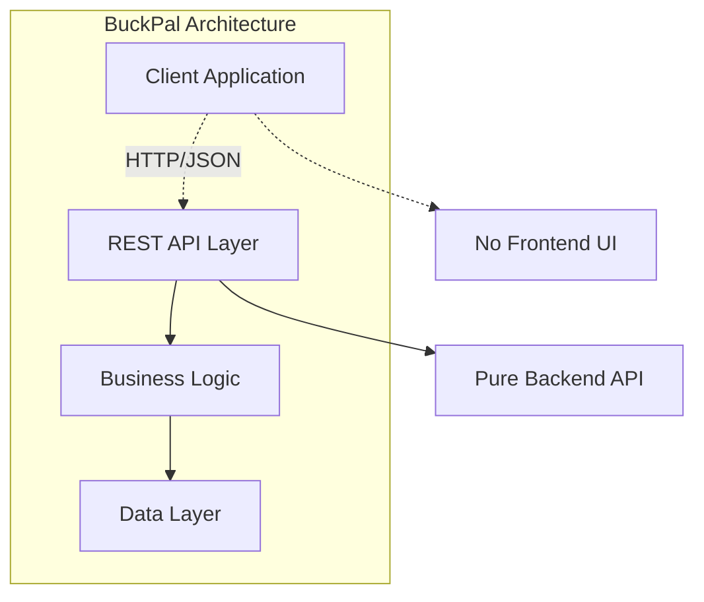
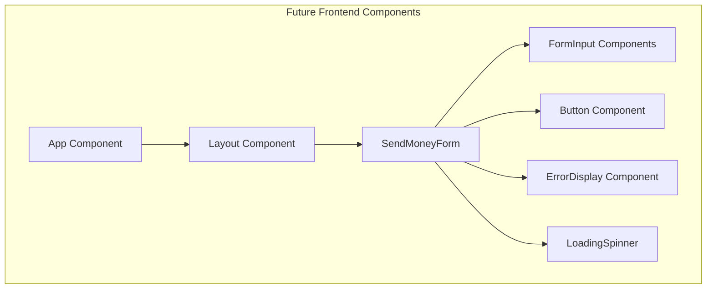

# UI 컴포넌트 문서

## UI 컴포넌트 현황

BuckPal 프로젝트는 **순수 백엔드 API 애플리케이션**으로 **프론트엔드 UI 컴포넌트가 없습니다**.

### 현재 아키텍처
- **백엔드**: Spring Boot REST API
- **프론트엔드**: 없음 (API만 제공)
- **클라이언트 통신**: HTTP/JSON



## 웹 계층 구성 요소

### 1. REST Controller Components

#### SendMoneyController
**파일 위치**: `src/main/java/dev/haja/buckpal/account/adapter/in/web/SendMoneyController.java`

```java
@WebAdapter
@RestController
@RequiredArgsConstructor
@Validated
public class SendMoneyController {
    
    private final SendMoneyUseCase sendMoneyUseCase;
    
    @PostMapping(path = "/accounts/send")
    void sendMoney(@Valid @RequestBody SendMoneyReqDto request) {
        // 송금 로직 처리
    }
}
```

**특징**:
- **단일 엔드포인트**: `/accounts/send` POST 요청만 처리
- **검증 통합**: `@Valid` 어노테이션으로 자동 입력 검증
- **커스텀 어노테이션**: `@WebAdapter`로 아키텍처 의도 표현
- **의존성 주입**: `SendMoneyUseCase` 포트 인터페이스 주입

### 2. Request/Response DTOs

#### SendMoneyReqDto
**파일 위치**: `src/main/java/dev/haja/buckpal/account/adapter/in/web/SendMoneyReqDto.java`

```java
public record SendMoneyReqDto(
    @NotNull(message = "출금 계좌 ID는 필수입니다")
    Long sourceAccountId,

    @NotNull(message = "입금 계좌 ID는 필수입니다") 
    Long targetAccountId,

    @NotNull(message = "금액은 필수입니다")
    @Positive(message = "금액은 양수여야 합니다")
    Long amount
) {}
```

**특징**:
- **Java 17 Record**: 불변 데이터 클래스
- **Bean Validation**: Jakarta 검증 어노테이션 활용
- **한국어 메시지**: 사용자 친화적 에러 메시지
- **타입 안전성**: Long 타입으로 정확한 금액 처리

### 3. 전역 예외 처리기

#### WebAdapter (Global Exception Handler)
**파일 위치**: `src/main/java/dev/haja/buckpal/common/WebAdapter.java`

```java
@RestControllerAdvice
public class WebAdapter {

    @ExceptionHandler(MethodArgumentNotValidException.class)
    @ResponseStatus(HttpStatus.BAD_REQUEST)
    public ResponseEntity<Map<String, String>> handleValidationExceptions(
            MethodArgumentNotValidException ex) {
        Map<String, String> errors = new HashMap<>();
        ex.getBindingResult().getAllErrors().forEach((error) -> {
            String fieldName = ((FieldError) error).getField();
            String errorMessage = error.getDefaultMessage();
            errors.put(fieldName, errorMessage);
        });
        return ResponseEntity.badRequest().body(errors);
    }
}
```

**기능**:
- **전역 예외 처리**: 모든 컨트롤러에서 발생하는 검증 오류 통합 처리
- **구조화된 응답**: 필드별 에러 메시지를 JSON 형태로 반환
- **HTTP 상태 코드**: 적절한 상태 코드 자동 설정

## API 응답 구조

### 성공 응답
```http
POST /accounts/send
Content-Type: application/json

{
    "sourceAccountId": 1,
    "targetAccountId": 2,
    "amount": 1000
}

HTTP/1.1 200 OK
Content-Length: 0
```

### 실패 응답 (검증 오류)
```http
POST /accounts/send
Content-Type: application/json

{
    "sourceAccountId": null,
    "targetAccountId": 2,
    "amount": -500
}

HTTP/1.1 400 Bad Request
Content-Type: application/json

{
    "sourceAccountId": "출금 계좌 ID는 필수입니다",
    "amount": "금액은 양수여야 합니다"
}
```

## 향후 UI 구성 시 권장사항

### 1. Frontend Framework 통합

#### React + TypeScript 구성 (권장)
```typescript
// types/api.ts
export interface SendMoneyRequest {
    sourceAccountId: number;
    targetAccountId: number; 
    amount: number;
}

export interface ValidationError {
    [field: string]: string;
}
```

#### API 클라이언트 구성
```typescript
// services/apiClient.ts
export class BuckPalApiClient {
    private baseUrl = 'http://localhost:8080';
    
    async sendMoney(request: SendMoneyRequest): Promise<void> {
        const response = await fetch(`${this.baseUrl}/accounts/send`, {
            method: 'POST',
            headers: {
                'Content-Type': 'application/json',
            },
            body: JSON.stringify(request),
        });
        
        if (!response.ok) {
            const errors: ValidationError = await response.json();
            throw new ValidationError(errors);
        }
    }
}
```

### 2. 컴포넌트 아키텍처 (예상)



#### 예상 컴포넌트 구조
```typescript
// components/SendMoneyForm.tsx
interface SendMoneyFormProps {
    onSubmit: (data: SendMoneyRequest) => Promise<void>;
    loading: boolean;
    errors?: ValidationError;
}

export const SendMoneyForm: React.FC<SendMoneyFormProps> = ({
    onSubmit,
    loading,
    errors
}) => {
    // 폼 구현
};
```

### 3. 디자인 시스템 토큰 (권장)

#### 색상 팔레트
```css
:root {
    /* Primary Colors */
    --color-primary: #007bff;
    --color-primary-hover: #0056b3;
    --color-primary-light: #cce7ff;
    
    /* Status Colors */
    --color-success: #28a745;
    --color-error: #dc3545;
    --color-warning: #ffc107;
    
    /* Neutral Colors */
    --color-gray-50: #f8f9fa;
    --color-gray-100: #e9ecef;
    --color-gray-500: #6c757d;
    --color-gray-900: #212529;
}
```

#### 간격 시스템
```css
:root {
    --spacing-xs: 0.25rem;    /* 4px */
    --spacing-sm: 0.5rem;     /* 8px */
    --spacing-md: 1rem;       /* 16px */
    --spacing-lg: 1.5rem;     /* 24px */
    --spacing-xl: 2rem;       /* 32px */
    --spacing-2xl: 3rem;      /* 48px */
}
```

#### 타이포그래피
```css
:root {
    --font-family-base: 'Noto Sans KR', -apple-system, BlinkMacSystemFont, sans-serif;
    --font-size-sm: 0.875rem;     /* 14px */
    --font-size-base: 1rem;       /* 16px */
    --font-size-lg: 1.125rem;     /* 18px */
    --font-size-xl: 1.25rem;      /* 20px */
    --font-size-2xl: 1.5rem;      /* 24px */
    
    --font-weight-normal: 400;
    --font-weight-medium: 500;
    --font-weight-semibold: 600;
    --font-weight-bold: 700;
}
```

## 테스트 전략

### 1. 현재 웹 계층 테스트

#### SendMoneyControllerTest
**파일 위치**: `src/test/java/dev/haja/buckpal/account/adapter/in/web/SendMoneyControllerTest.java`

```java
@WebMvcTest(SendMoneyController.class)
class SendMoneyControllerTest {
    
    @Autowired
    private MockMvc mockMvc;
    
    @MockBean
    private SendMoneyUseCase sendMoneyUseCase;
    
    @Test
    void testSendMoney() throws Exception {
        // MockMvc를 통한 웹 계층 테스트
    }
}
```

### 2. 향후 프론트엔드 테스트 (권장)

#### 컴포넌트 테스트
```typescript
// __tests__/SendMoneyForm.test.tsx
import { render, screen, fireEvent, waitFor } from '@testing-library/react';
import { SendMoneyForm } from '../SendMoneyForm';

describe('SendMoneyForm', () => {
    test('validates required fields', async () => {
        const onSubmit = jest.fn();
        render(<SendMoneyForm onSubmit={onSubmit} loading={false} />);
        
        fireEvent.click(screen.getByRole('button', { name: '송금' }));
        
        await waitFor(() => {
            expect(screen.getByText('출금 계좌 ID는 필수입니다')).toBeInTheDocument();
        });
    });
});
```

#### E2E 테스트
```typescript
// e2e/sendMoney.spec.ts
import { test, expect } from '@playwright/test';

test('send money flow', async ({ page }) => {
    await page.goto('/');
    
    await page.fill('[data-testid="source-account"]', '1');
    await page.fill('[data-testid="target-account"]', '2');
    await page.fill('[data-testid="amount"]', '1000');
    
    await page.click('[data-testid="send-button"]');
    
    await expect(page.locator('.success-message')).toBeVisible();
});
```

## Storybook 구성 (권장)

### Storybook 스토리 예시
```typescript
// stories/SendMoneyForm.stories.tsx
import type { Meta, StoryObj } from '@storybook/react';
import { SendMoneyForm } from '../components/SendMoneyForm';

const meta: Meta<typeof SendMoneyForm> = {
    title: 'Forms/SendMoneyForm',
    component: SendMoneyForm,
    parameters: {
        docs: {
            description: {
                component: 'BuckPal 송금 폼 컴포넌트'
            }
        }
    }
};

export default meta;
type Story = StoryObj<typeof SendMoneyForm>;

export const Default: Story = {
    args: {
        onSubmit: async () => {},
        loading: false,
    }
};

export const WithValidationErrors: Story = {
    args: {
        onSubmit: async () => {},
        loading: false,
        errors: {
            sourceAccountId: '출금 계좌 ID는 필수입니다',
            amount: '금액은 양수여야 합니다'
        }
    }
};

export const Loading: Story = {
    args: {
        onSubmit: async () => {},
        loading: true,
    }
};
```

## 접근성 고려사항

### ARIA 레이블 및 역할
```typescript
// 접근성을 고려한 폼 구성
export const SendMoneyForm = () => (
    <form role="form" aria-label="송금 폼">
        <div>
            <label htmlFor="source-account">출금 계좌</label>
            <input
                id="source-account"
                type="number"
                aria-describedby="source-account-error"
                aria-invalid={errors.sourceAccountId ? 'true' : 'false'}
            />
            <div id="source-account-error" role="alert">
                {errors.sourceAccountId}
            </div>
        </div>
        
        <button type="submit" aria-label="송금 실행">
            송금
        </button>
    </form>
);
```

**현재 BuckPal은 순수 백엔드 프로젝트이지만, 향후 프론트엔드 통합 시 위의 권장사항을 따르면 일관성 있고 사용자 친화적인 UI를 구축할 수 있습니다.**