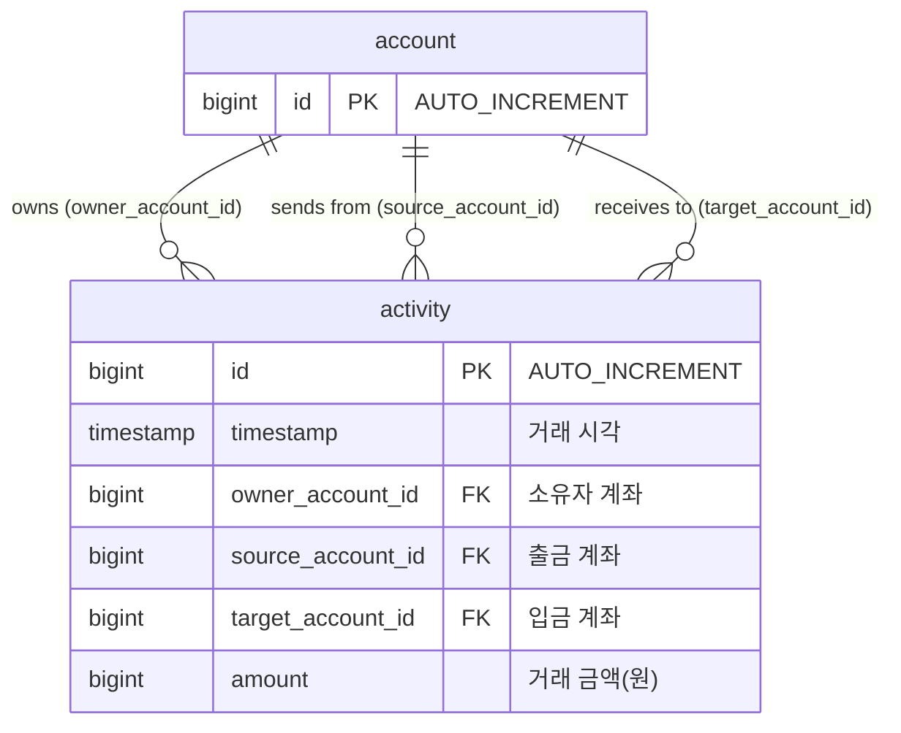

# 데이터베이스 스키마 문서

## 데이터베이스 개요

BuckPal 프로젝트는 **H2 인메모리 데이터베이스**를 사용하는 **관계형 데이터베이스(RDBMS)** 기반 시스템입니다.

### 기술 스택
- **데이터베이스**: H2 Database (In-Memory)
- **ORM**: Spring Data JPA + Hibernate
- **DDL 전략**: `create-drop` (개발 환경)
- **테이블 수**: 2개 (`account`, `activity`)
- **관계**: 1:N (Account → Activities)

## 테이블 구조

### 1. Account 테이블

**테이블명**: `account`
**목적**: 계좌 기본 정보 저장

```sql
-- DDL (Hibernate 자동 생성)
CREATE TABLE account (
    id BIGINT GENERATED BY DEFAULT AS IDENTITY,
    PRIMARY KEY (id)
);
```

#### 필드 정의
| 필드명 | 데이터 타입 | NULL 허용 | 기본값 | 제약조건 | 설명 |
|--------|-------------|-----------|---------|----------|------|
| `id` | `BIGINT` | ❌ No | AUTO_INCREMENT | PRIMARY KEY | 계좌 고유 식별자 |

#### 인덱스
```sql
-- 기본 인덱스 (Hibernate 자동 생성)
CREATE UNIQUE INDEX idx_account_pk ON account (id);
```

### 2. Activity 테이블  

**테이블명**: `activity` (소문자, JPA Entity는 Activity)
**목적**: 모든 거래 활동(입금/출금) 기록

```sql
-- DDL (Hibernate 자동 생성)
CREATE TABLE activity (
    id BIGINT GENERATED BY DEFAULT AS IDENTITY,
    timestamp TIMESTAMP,
    owner_account_id BIGINT,
    source_account_id BIGINT,
    target_account_id BIGINT,
    amount BIGINT,
    PRIMARY KEY (id)
);
```

#### 필드 정의
| 필드명 | 데이터 타입 | NULL 허용 | 기본값 | 제약조건 | 설명 |
|--------|-------------|-----------|---------|----------|------|
| `id` | `BIGINT` | ❌ No | AUTO_INCREMENT | PRIMARY KEY | 거래 고유 식별자 |
| `timestamp` | `TIMESTAMP` | ✅ Yes | NULL | - | 거래 발생 시각 |
| `owner_account_id` | `BIGINT` | ✅ Yes | NULL | - | 이 거래 기록의 소유자 계좌 |
| `source_account_id` | `BIGINT` | ✅ Yes | NULL | - | 출금(송금) 계좌 ID |
| `target_account_id` | `BIGINT` | ✅ Yes | NULL | - | 입금(수취) 계좌 ID |
| `amount` | `BIGINT` | ✅ Yes | NULL | - | 거래 금액 (원 단위) |

#### 외래키 관계 (논리적)
- `owner_account_id` → `account.id` (논리적 관계, 물리적 FK 없음)
- `source_account_id` → `account.id` (논리적 관계, 물리적 FK 없음)  
- `target_account_id` → `account.id` (논리적 관계, 물리적 FK 없음)

#### 인덱스 (필요하지만 현재 없음)
```sql
-- 현재 구현되지 않은 인덱스들 (성능 최적화를 위해 추가 권장)
CREATE INDEX idx_activity_owner_timestamp ON activity (owner_account_id, timestamp);
CREATE INDEX idx_activity_source_timestamp ON activity (source_account_id, timestamp);
CREATE INDEX idx_activity_target_timestamp ON activity (target_account_id, timestamp);
CREATE INDEX idx_activity_timestamp ON activity (timestamp);
```

## 엔티티 관계 다이어그램 (ERD)



## 데이터 무결성 및 제약조건

### 1. 현재 구현된 제약조건
- ✅ **기본키 제약**: 각 테이블의 `id` 필드
- ✅ **NOT NULL 제약**: Primary Key만 적용

### 2. 누락된 제약조건 (권장)
```sql
-- 금액 제약조건 (양수여야 함)
ALTER TABLE activity ADD CONSTRAINT chk_activity_amount_positive 
    CHECK (amount > 0);

-- 타임스탬프 제약조건 (미래 시점 방지)
ALTER TABLE activity ADD CONSTRAINT chk_activity_timestamp_past 
    CHECK (timestamp <= CURRENT_TIMESTAMP);

-- 자기 자신에게 송금 방지
ALTER TABLE activity ADD CONSTRAINT chk_activity_different_accounts 
    CHECK (source_account_id != target_account_id);

-- 외래키 제약조건 (데이터 일관성)
ALTER TABLE activity ADD CONSTRAINT fk_activity_owner 
    FOREIGN KEY (owner_account_id) REFERENCES account(id);
ALTER TABLE activity ADD CONSTRAINT fk_activity_source 
    FOREIGN KEY (source_account_id) REFERENCES account(id);
ALTER TABLE activity ADD CONSTRAINT fk_activity_target 
    FOREIGN KEY (target_account_id) REFERENCES account(id);
```

## 비즈니스 규칙 반영

### 1. 송금 거래의 이중 기록 방식
BuckPal은 하나의 송금 거래를 **두 개의 Activity 레코드**로 저장합니다:

```sql
-- 예시: 계좌1 → 계좌2로 500원 송금
-- 출금 기록 (계좌1 소유)
INSERT INTO activity (owner_account_id, source_account_id, target_account_id, amount) 
VALUES (1, 1, 2, 500);

-- 입금 기록 (계좌2 소유) 
INSERT INTO activity (owner_account_id, source_account_id, target_account_id, amount)
VALUES (2, 1, 2, 500);
```

### 2. 잔액 계산 방식 (쿼리 기반)
잔액은 별도 테이블에 저장되지 않고 **Activity 테이블 집계**로 실시간 계산:

```sql
-- 입금 총액 계산 (특정 시점까지)
SELECT SUM(amount) as deposit_balance
FROM activity 
WHERE target_account_id = :accountId 
  AND owner_account_id = :accountId 
  AND timestamp < :until;

-- 출금 총액 계산 (특정 시점까지)  
SELECT SUM(amount) as withdrawal_balance
FROM activity 
WHERE source_account_id = :accountId 
  AND owner_account_id = :accountId 
  AND timestamp < :until;

-- 최종 잔액 = 입금 총액 - 출금 총액
```

## 데이터베이스 설정

### H2 Database 설정
```yaml
# application-local.yml
spring:
  jpa:
    hibernate:
      ddl-auto: create-drop  # 애플리케이션 재시작 시 스키마 재생성
    properties:
      hibernate:
        show_sql: false      # 콘솔 출력 비활성화
        format_sql: true     # SQL 포맷팅
        use_sql_comments: true # SQL 주석 추가
```

### JPA 로깅 설정
```yaml
logging.level:
  org.hibernate.SQL: debug     # SQL 쿼리 로깅
  org.hibernate.type: trace    # 파라미터 값 로깅
```

## 스키마 진화 및 마이그레이션

### 1. 현재 상태
- ❌ **마이그레이션 도구 없음**: Flyway, Liquibase 미사용
- ❌ **버전 관리 없음**: 스키마 변경 이력 없음
- ⚠️ **create-drop 방식**: 데이터 손실 위험

### 2. 프로덕션 배포 시 고려사항
```yaml
# application-prod.yml (권장)
spring:
  jpa:
    hibernate:
      ddl-auto: validate    # 스키마 검증만 수행
  flyway:
    enabled: true          # Flyway 마이그레이션 활성화
    locations: classpath:db/migration
```

### 3. 마이그레이션 파일 예시 (향후)
```sql
-- V1__Create_base_schema.sql
CREATE TABLE account (
    id BIGINT GENERATED BY DEFAULT AS IDENTITY,
    PRIMARY KEY (id)
);

CREATE TABLE activity (
    id BIGINT GENERATED BY DEFAULT AS IDENTITY,
    timestamp TIMESTAMP,
    owner_account_id BIGINT NOT NULL,
    source_account_id BIGINT NOT NULL,
    target_account_id BIGINT NOT NULL,
    amount BIGINT NOT NULL CHECK (amount > 0),
    PRIMARY KEY (id),
    FOREIGN KEY (owner_account_id) REFERENCES account(id),
    FOREIGN KEY (source_account_id) REFERENCES account(id),
    FOREIGN KEY (target_account_id) REFERENCES account(id)
);

-- 성능 인덱스
CREATE INDEX idx_activity_owner_timestamp ON activity (owner_account_id, timestamp);
CREATE INDEX idx_activity_source_timestamp ON activity (source_account_id, timestamp);
CREATE INDEX idx_activity_target_timestamp ON activity (target_account_id, timestamp);
```

## 성능 최적화 고려사항

### 1. 쿼리 성능
- **문제점**: 잔액 계산을 위한 전체 Activity 스캔
- **해결책**: 타임스탬프 기반 인덱스 추가

### 2. 확장성 고려
- **읽기 전용 복제본**: 잔액 조회용 Read Replica
- **파티셔닝**: Activity 테이블의 날짜별 파티셔닝
- **캐싱**: 계좌 잔액 Redis 캐싱

### 3. 아키텍처 개선 방안
- **CQRS 패턴**: Command/Query 분리로 읽기 성능 향상
- **이벤트 소싱**: Activity를 이벤트 스트림으로 관리
- **스냅샷 테이블**: 일정 주기별 잔액 스냅샷 생성

**현재 스키마는 헥사고날 아키텍처의 단순성을 보여주는 최소한의 구조로, 프로덕션 환경에서는 성능과 무결성을 위한 추가 설계가 필요합니다.**